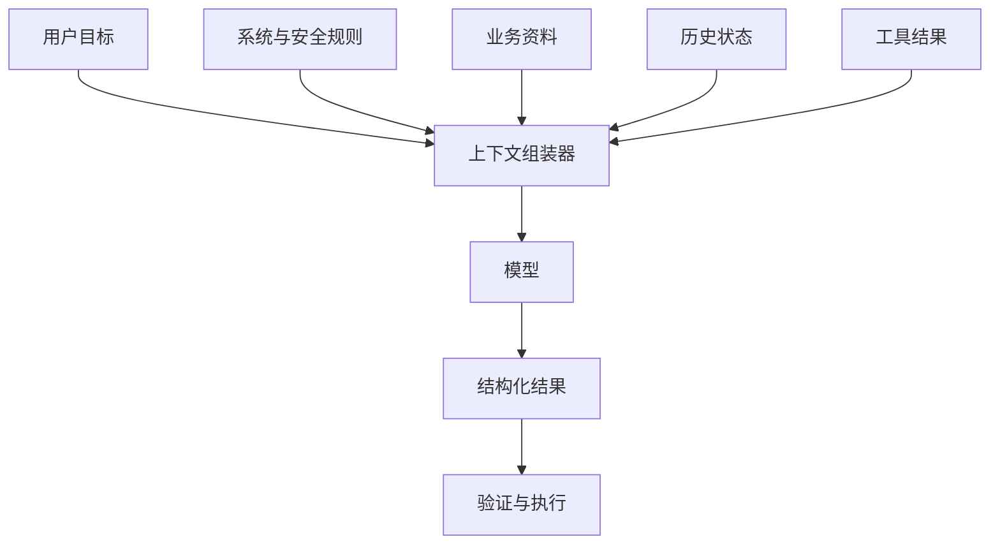

# 01｜上下文工程（Context Engineering）

## 1. 为什么它比“提示词技巧”更重要

提示词只是当前一句要求；上下文则是模型完成任务时能够看到的全部信息，包括系统规则、用户目标、业务材料、历史对话、工具结果和输出约束。上下文工程的目标，是在有限窗口中放入**足够、相关、可信、顺序清楚**的信息。



上下文不是越多越好。无关内容会挤占窗口、制造冲突，并让关键要求更难被注意。

## 2. 上下文的六层结构

| 层级 | 内容 | 周报助手示例 |
| --- | --- | --- |
| 规则 | 不可被普通输入覆盖的边界 | 不编造进展、不泄露客户信息 |
| 目标 | 当前任务和成功标准 | 生成供负责人审核的本周周报 |
| 业务背景 | 项目、受众、术语、格式 | 项目阶段、负责人偏好的栏目 |
| 证据 | 原文、数据、工具结果 | PR、工单、会议纪要 |
| 状态 | 已完成、待确认、下一步 | 上轮草稿、未解决问题 |
| 输出约束 | Schema、长度、引用方式 | 成果、风险、计划、依据链接 |

## 3. 一个失败例子

```text
帮我根据这些记录写周报，写专业一点。
```

它缺少时间范围、读者、栏目、事实边界和验收标准。模型只能依靠默认写法补全，结果容易空泛。

改进后的上下文包：

```markdown
任务：生成 7 月 14 日至 18 日的项目周报草稿。
受众：研发负责人，阅读时间不超过 2 分钟。
规则：只使用附件记录；没有负责人或日期时标记“待确认”；不得猜测。
结构：本周成果、进行中、风险、下周计划、待确认。
证据：每条成果附原始 PR 或工单编号。
验收：事实可追溯；计划不写成成果；风险包含影响和下一步。
```

## 4. 上下文组装流程


实践时按以下顺序：

1. 先写一句成功标准；
2. 列出完成任务必须知道的事实；
3. 删除与当前决策无关的材料；
4. 把规则、事实、示例和待确认项分区；
5. 为外部资料记录来源、日期和权限；
6. 输出后检查模型是否真的依据这些材料。

## 5. 冲突和优先级

当上下文中出现冲突时，不能让模型自行“平均”。例如工单写“周五上线”，会议纪要写“延期到下周”。正确做法是同时保留来源与时间，要求输出“存在冲突，待负责人确认”。

```json
{
  "claim": "上线时间",
  "sources": [
    { "value": "周五", "source": "TASK-128", "date": "2026-07-17" },
    { "value": "下周", "source": "会议纪要", "date": "2026-07-18" }
  ],
  "status": "needs_confirmation"
}
```

## 6. 常见错误

- 把全部历史聊天原样塞回模型；
- 只给结论，不给来源和时间；
- 同一规则在不同位置出现互相矛盾的版本；
- 把示例内容误当作当前真实数据；
- 用模型生成的摘要替代原始证据，却没有保留追溯路径；
- 在上下文中放入任务不需要的敏感信息。

## 7. 安全边界

上下文是数据暴露的主要入口。应在组装前做权限判断和最小化，只提供当前任务所需字段；外部网页、邮件和文档中的指令应视为不可信数据，不能覆盖系统规则。

## 8. 完成练习

为“项目周报助手”制作一个上下文清单，必须包含六层结构。再准备一个冲突事实，验证输出是否会标记待确认，而不是自行选择答案。

## 参考资料

- [OpenAI Prompting 指南](https://developers.openai.com/api/docs/guides/prompting)
- [OpenAI Tools 指南](https://developers.openai.com/api/docs/guides/tools)

[下一篇：Structured Outputs 与 JSON Schema →](./02-结构化输出与JSON模式.md)
