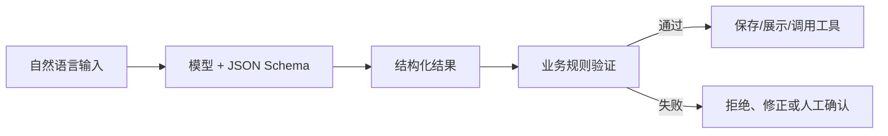
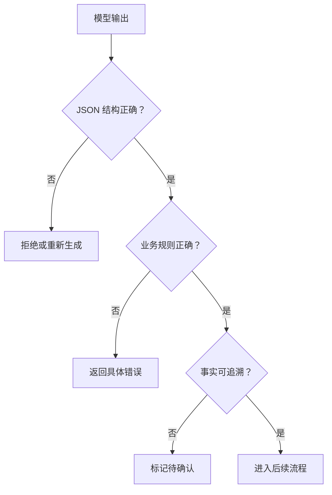

# 02｜Structured Outputs 与 JSON Schema

## 1. 为什么不能只要求“返回 JSON”

“返回 JSON”只能约束外观，不能保证字段完整、类型正确或枚举合法。Structured Outputs 的核心价值，是让输出遵循明确的 JSON Schema，使下游程序能够可靠解析和验证。



Schema 只能保证结构，不能保证事实真实。例如 `deadline` 符合日期格式，也可能不是原始材料中的真实日期。

## 2. 周报条目的 Schema

```json
{
  "type": "object",
  "properties": {
    "period": {
      "type": "object",
      "properties": {
        "start": { "type": "string", "format": "date" },
        "end": { "type": "string", "format": "date" }
      },
      "required": ["start", "end"],
      "additionalProperties": false
    },
    "achievements": {
      "type": "array",
      "items": {
        "type": "object",
        "properties": {
          "title": { "type": "string", "minLength": 1 },
          "source_id": { "type": "string", "minLength": 1 },
          "status": { "type": "string", "enum": ["confirmed", "needs_confirmation"] }
        },
        "required": ["title", "source_id", "status"],
        "additionalProperties": false
      }
    },
    "open_questions": {
      "type": "array",
      "items": { "type": "string" }
    }
  },
  "required": ["period", "achievements", "open_questions"],
  "additionalProperties": false
}
```

`additionalProperties: false` 能防止模型随意增加下游程序不认识的字段；`enum` 把状态限制在业务允许范围内。

## 3. Schema 设计原则

1. **字段语义单一：** 不用一个 `content` 同时装标题、说明和风险；
2. **区分缺失与空值：** 未知、无内容和不适用不是同一状态；
3. **使用枚举：** 业务状态不要留给自由文本；
4. **限制额外字段：** 防止无意扩展接口；
5. **字段描述具体：** 写明单位、时区、长度和证据要求；
6. **控制嵌套深度：** 过深的结构难以维护和排错；
7. **为版本留位置：** 重要契约加入 `schema_version`。

## 4. 结构验证不等于业务验证



应用端仍需检查：开始日期不得晚于结束日期；`source_id` 必须存在且当前用户有权访问；“已确认”条目必须能在原始资料中找到。

```ts
function validateReport(report: WeeklyReport, sourceIds: Set<string>) {
  if (report.period.start > report.period.end) {
    throw new Error("时间范围无效");
  }
  for (const item of report.achievements) {
    if (!sourceIds.has(item.source_id)) {
      throw new Error(`来源不存在或不可访问: ${item.source_id}`);
    }
  }
}
```

## 5. Schema 演进

修改字段会影响调用方。新增必填字段、修改枚举或改变类型都可能造成破坏性变更。为 Schema 建立版本，并让旧消费者有迁移窗口。

| 变化 | 风险 | 建议 |
| --- | --- | --- |
| 新增可选字段 | 低 | 消费者忽略未知字段或同步升级 |
| 新增必填字段 | 高 | 发布新版本并迁移 |
| 删除枚举值 | 高 | 先停止产生，再迁移历史数据 |
| 字符串改数组 | 高 | 新字段并行过渡 |

## 6. 常见错误

- 把所有字段都设成可选，导致结果无法使用；
- 用长字符串承载本应结构化的数据；
- 只验证 JSON 格式，不验证业务权限和事实；
- Schema 频繁变化却没有版本；
- 把模型拒答、工具错误和业务空结果混成同一种返回。

## 7. 完成练习

为周报中的“风险”设计 Schema，至少包含影响等级、事实依据、负责人、下一步和确认状态。再写三条应用端业务校验，确保合法 JSON 也不能绕过业务规则。

## 参考资料

- [OpenAI Structured Outputs](https://developers.openai.com/api/docs/guides/structured-outputs)
- [JSON Schema](https://json-schema.org/learn/getting-started-step-by-step)

[← 上一篇](./01-上下文工程.md) · [下一篇：工具设计 →](./03-工具设计.md)
