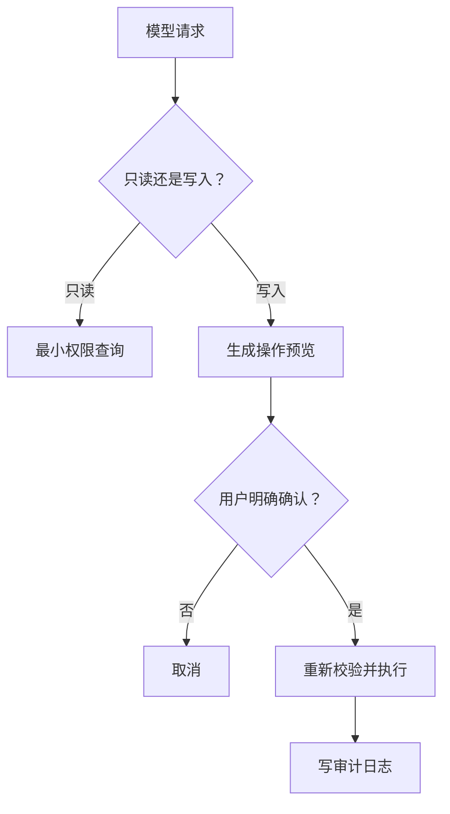

# 03｜工具设计（Tool Design）

## 1. 工具是模型与真实世界之间的合同

工具把自然语言意图转换成受控能力。模型可以提出调用，但应用必须负责参数校验、权限判断、执行和审计。一个好工具应当职责单一、名字明确、输入有限、结果可解释。


## 2. 从业务动作切分工具

周报助手可能需要这些工具：

| 工具 | 副作用 | 是否需确认 |
| --- | --- | --- |
| `list_merged_prs` | 无，只读 | 否 |
| `get_ticket_summary` | 无，只读 | 否 |
| `create_report_draft` | 创建草稿 | 通常否，但需审计 |
| `publish_report` | 对外发布 | 是 |

不要设计 `manage_project` 这样的万能工具。它会把查询、修改、删除等权限混在一起，使模型难以选择，也让安全控制失去边界。

## 3. 工具定义示例

```json
{
  "name": "list_merged_prs",
  "description": "列出指定项目和日期范围内已合并的 PR。只读；不返回私密评论、邮箱或令牌。",
  "parameters": {
    "type": "object",
    "properties": {
      "project_id": { "type": "string", "description": "当前用户有权访问的项目 ID" },
      "start_date": { "type": "string", "format": "date" },
      "end_date": { "type": "string", "format": "date" },
      "limit": { "type": "integer", "minimum": 1, "maximum": 100 }
    },
    "required": ["project_id", "start_date", "end_date"],
    "additionalProperties": false
  }
}
```

描述要说明何时使用、是否只读、返回边界和不适用场景；服务端不能相信描述本身，仍需执行授权检查。

## 4. 读取和写入分离



“预览”和“执行”最好是不同工具。例如先用 `preview_publish_report` 返回受众、内容摘要和影响范围，再由明确确认触发 `publish_report`。

## 5. 返回值设计

工具结果应当小而结构化，包含业务数据、状态与可重试信息。

```json
{
  "status": "success",
  "items": [
    { "id": "PR-42", "title": "增加导出功能", "merged_at": "2026-07-18" }
  ],
  "next_cursor": null,
  "request_id": "req_7f31"
}
```

不要把服务器堆栈、访问令牌、数据库内部字段或整个文档原样返回给模型。

## 6. 错误分类

| 错误 | 返回方式 | 模型下一步 |
| --- | --- | --- |
| 参数无效 | 指明字段和规则 | 修正参数一次 |
| 无权限 | 明确拒绝，不透露资源存在性 | 告知用户申请权限 |
| 无结果 | 正常空集合和查询范围 | 标注无数据，不编造 |
| 暂时失败 | 返回可重试标记与请求 ID | 按退避策略重试 |
| 需要确认 | 返回预览和确认令牌 | 等待用户确认 |

## 7. 工具测试

至少覆盖：正常调用、边界参数、越权、空结果、超时、重复调用、恶意字符串和取消确认。还要测试模型是否会在不该调用时调用工具。

## 8. 常见错误与安全边界

- 工具太大、职责重叠；
- 参数可以直接进入 SQL、Shell 或 URL；
- 只在提示词里限制权限，服务端没有校验；
- 写操作没有预览和确认；
- 错误信息暴露内部实现；
- 工具结果中的外部文本被当作系统指令。

## 9. 完成练习

为周报助手设计四个工具：两个只读、一个创建草稿、一个发布。分别写出输入、输出、权限、副作用、错误和确认规则，然后解释为什么不能合并成一个工具。

## 参考资料

- [OpenAI Tools](https://developers.openai.com/api/docs/guides/tools)
- [OpenAI Function Calling](https://developers.openai.com/api/docs/guides/function-calling)

[← 上一篇](./02-结构化输出与JSON模式.md) · [下一篇：Agent Loop →](./04-智能体循环.md)
