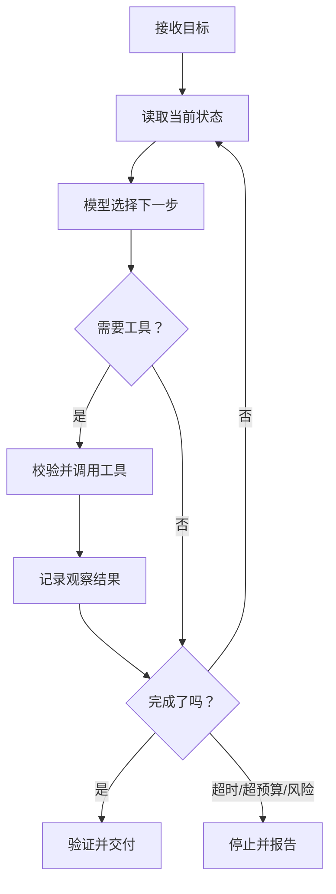
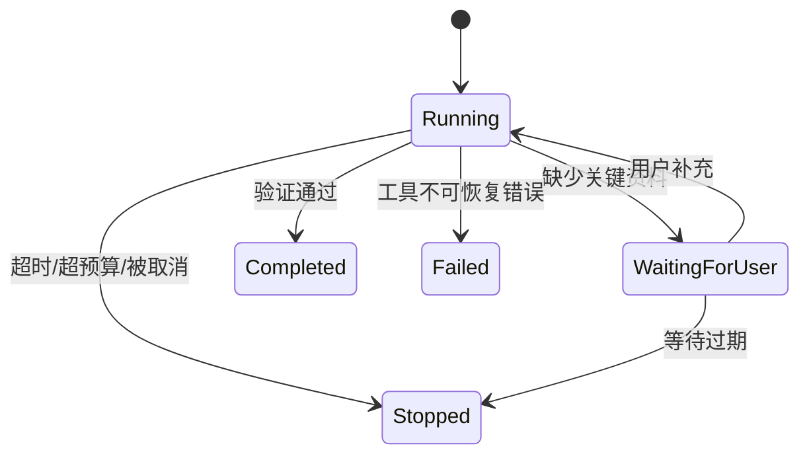

# 04｜Agent Loop：智能体如何循环完成任务

## 1. Agent 不只是“一次模型调用”

普通生成是输入一次、输出一次；Agent 会在目标、当前状态和工具结果之间循环，直到完成、失败、被取消或达到预算上限。



循环越自主，越需要清楚的停止条件、预算、权限和可观测性。

## 2. 周报助手的循环

目标是“生成一份来源完整的周报草稿”。智能体可能依次：读取任务列表、读取 PR、发现里程碑缺失、请求补充资料、生成草稿、执行事实检查。

但它不应为了“看起来完整”无限搜索，也不应在负责人未确认时自动发布。

## 3. 最小循环伪代码

```ts
async function runAgent(goal: Goal, limits: Limits) {
  let state = createInitialState(goal);

  for (let step = 0; step < limits.maxSteps; step++) {
    if (Date.now() > limits.deadline) return stop("timeout", state);
    if (state.cost >= limits.maxCost) return stop("budget_exceeded", state);

    const decision = await model.decide(state);
    validateDecision(decision, state.permissions);

    if (decision.type === "finish") {
      return verifyAndReturn(decision.output, state);
    }

    const result = await executeToolWithPolicy(decision.toolCall);
    state = appendObservation(state, decision, result);
  }

  return stop("max_steps_reached", state);
}
```

循环外层必须是确定性代码：计步、计时、计费、权限与停止不能只靠模型自觉。

## 4. 完成条件要可验证

“写得不错”不是完成条件。周报助手可以使用：

- 存在明确时间范围；
- 每条成果都有来源 ID；
- 风险包含影响和下一步；
- 未确认事实没有伪装成确定结论；
- 输出符合 Schema；
- 发布步骤仍等待负责人确认。

## 5. 失败与停止状态



系统要把“等待用户”“正常空结果”“暂时失败”和“任务完成”区分开，否则容易重复调用或错误宣布完成。

## 6. 控制自主性的四个旋钮

| 控制 | 作用 | 示例 |
| --- | --- | --- |
| 最大步数 | 防止无限循环 | 最多 12 次决策 |
| 工具白名单 | 限制可做的动作 | 生成阶段只允许只读工具 |
| 预算 | 控制成本和延迟 | 规定 Token、金额和时间 |
| 审批点 | 控制高影响动作 | 发布前必须人工确认 |

## 7. 常见错误

- 把模型说“完成了”直接视为完成；
- 工具失败后无条件重复调用；
- 每一轮都带回全部历史，导致上下文膨胀；
- 没有取消、超时和预算机制；
- 把计划、观察结果和真实业务状态混在一起；
- Agent 具有完成任务并不需要的写权限。

## 8. 完成练习

画出周报助手的状态图，至少包含运行、等待用户、完成、失败和停止；为每个状态写进入条件和允许调用的工具，再设置最大步数、超时和发布审批点。

## 参考资料

- [OpenAI Agents SDK](https://openai.github.io/openai-agents-python/)
- [OpenAI Tools](https://developers.openai.com/api/docs/guides/tools)

[← 上一篇](./03-工具设计.md) · [下一篇：状态管理 →](./05-状态管理.md)
