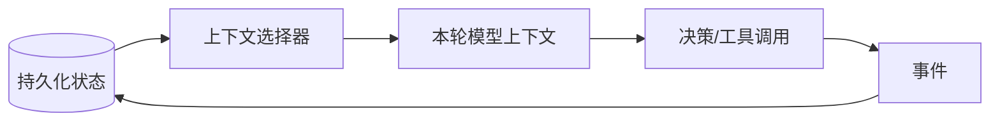
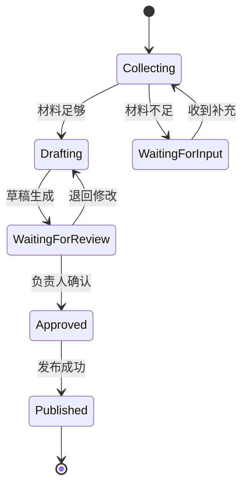

# 05｜状态管理：让长任务可恢复、可追踪

## 1. 状态和上下文不是同一件事

状态是系统当前真实情况；上下文是某次模型调用选择看到的信息。状态可以很大且持久化，而上下文应按任务需要从状态中选择和压缩。



例如数据库中记录草稿版本、审批人和调用状态；模型当前只需要看到最新草稿、未确认问题与允许的下一步。

## 2. 四种状态

| 状态类型 | 内容 | 存放位置 |
| --- | --- | --- |
| 对话状态 | 当前轮意图、最近消息 | 会话存储 |
| 任务状态 | 步骤、进度、错误、等待事项 | 任务数据库 |
| 业务状态 | 工单、订单、发布结果 | 业务系统，唯一事实源 |
| 长期记忆 | 获授权保存的稳定偏好 | 独立记忆存储 |

不能因为模型记得“报告已发布”，就把它当作真实业务状态；必须查询发布系统。

## 3. 周报任务状态模型

```json
{
  "task_id": "weekly_2026_w29",
  "status": "waiting_for_review",
  "version": 4,
  "period": { "start": "2026-07-13", "end": "2026-07-19" },
  "completed_steps": ["collect_prs", "collect_tickets", "draft"],
  "open_questions": ["确认项目 A 上线日期"],
  "draft_id": "draft_4",
  "allowed_next_actions": ["revise_draft", "approve_draft", "cancel"],
  "updated_at": "2026-07-20T09:30:00+08:00"
}
```

`allowed_next_actions` 能防止模型从任意状态跳到不合法动作，例如草稿不存在时直接发布。

## 4. 用状态机约束流程



每次状态转换应由服务端规则验证，并记录操作者、时间、旧状态、新状态和请求 ID。

## 5. 并发和版本冲突

负责人审核版本 3 时，智能体可能已经生成版本 4。使用乐观锁或版本号避免旧审核覆盖新内容。

```ts
async function approveDraft(taskId: string, expectedVersion: number) {
  const task = await store.get(taskId);
  if (task.version !== expectedVersion) {
    throw new Error("草稿已更新，请重新审核最新版本");
  }
  return store.transition(taskId, "approved", expectedVersion);
}
```

## 6. 恢复与重放

长任务应保存关键检查点，而不是失败后从头开始。记录事件可以帮助重建状态：收集完成、工具失败、草稿创建、人工退回、审批通过。

恢复时必须检查外部副作用是否已经发生。例如发布请求超时，不应立刻重复发布；先通过幂等键或查询接口确认原请求结果。

## 7. 常见错误与安全边界

- 把聊天记录当数据库；
- 让模型直接决定状态转换是否合法；
- 没有版本，导致并发覆盖；
- 状态中永久保存不必要的敏感内容；
- 失败后从头执行所有写操作；
- 业务系统和 Agent 状态不一致时相信 Agent。

## 8. 完成练习

为周报助手列出全部状态和允许的转换，设计一个包含 `task_id`、`status`、`version`、`open_questions` 和 `allowed_next_actions` 的状态对象。模拟“审核期间草稿被更新”，验证旧版本审批会被拒绝。

## 参考资料

- [OpenAI Agents SDK Sessions](https://openai.github.io/openai-agents-python/sessions/)
- [OpenAI Agents SDK Results](https://openai.github.io/openai-agents-python/results/)

[← 上一篇](./04-智能体循环.md) · [下一篇：RAG →](./06-检索增强生成.md)
