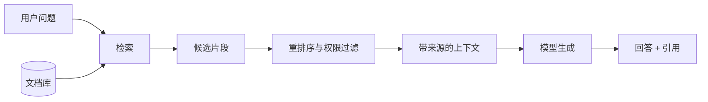
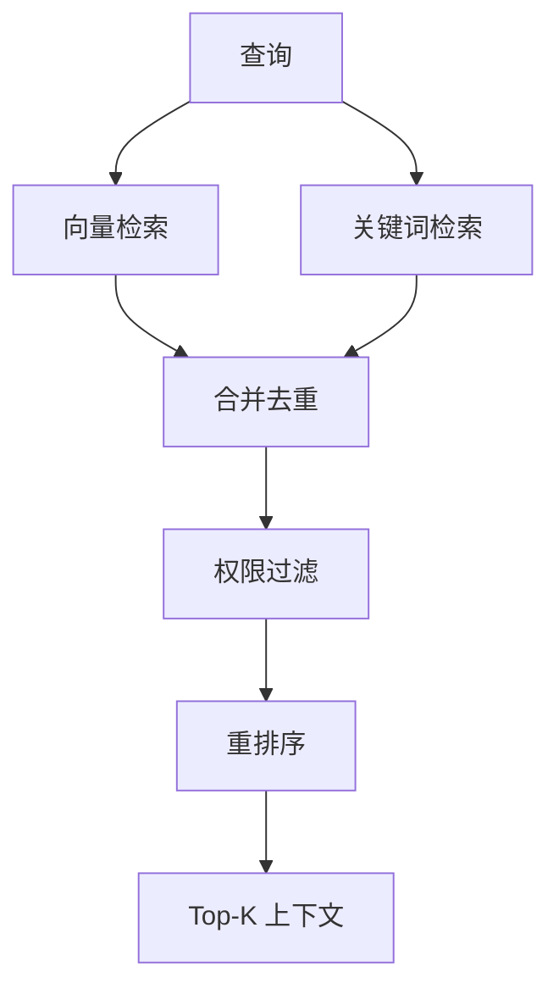

# 06｜RAG：让 AI 基于可追溯资料回答

## 1. RAG 解决什么问题

RAG（Retrieval-Augmented Generation，检索增强生成）先从知识库找出与问题相关的资料，再把这些资料放入上下文生成回答。它适合内部制度、产品文档、项目资料和不断更新的知识。

RAG 不是“把所有文档都塞给模型”，也不能自动保证答案正确。检索不到、检索错误、资料过期都会影响结果。

## 2. 建库流程

1. 获取获授权的原始文档；
2. 解析标题、正文、表格和元数据；
3. 按语义和文档结构切分；
4. 生成 Embedding 并建立索引；
5. 保存来源、版本、时间和权限；
6. 用真实问题测试召回结果。

片段必须保留 `document_id`、标题、章节、版本、更新时间和访问范围，不能只存一段失去出处的文字。

## 3. 切分不是固定字数游戏

按章节、段落和主题切分通常比机械每 500 字切分更可靠。表格、代码和步骤列表应保持完整；同时使用少量重叠，避免答案落在片段边界。

| 内容 | 建议切分 |
| --- | --- |
| 制度文档 | 按条款和小节 |
| API 文档 | 一个端点或概念一块 |
| 会议纪要 | 按议题和决策 |
| FAQ | 一个问题与答案一块 |
| 表格 | 保留表头与相关行 |

## 4. 混合检索与重排序

语义检索擅长近义表达，关键词检索擅长精确编号、人名和错误码。生产系统常把两者组合，再用重排序器挑出最相关片段。

权限过滤应在资料进入模型上下文之前完成，不能只靠回答阶段隐藏。

## 5. 周报助手示例

用户问：“项目 A 延期风险最早什么时候提出？”系统检索会议纪要、风险登记和工单评论，返回三个带日期片段。模型需要区分“首次提出”“正式确认”和“采取措施”，并引用原文位置；若资料冲突，应列出冲突而不是选一个顺眼答案。

## 6. 如何评估检索

- **召回率：** 正确资料是否进入候选集；
- **精确率：** 候选中有多少真正相关；
- **排序质量：** 最有用资料是否排在前面；
- **引用准确率：** 回答是否被引用片段支持；
- **拒答质量：** 没有资料时是否明确说不知道。

## 7. 常见错误与安全边界

- 只测试“回答看起来对不对”，不测试检索结果；
- 文档更新后旧片段仍在索引中；
- 不保存来源和权限；
- 把检索到的恶意指令当系统规则；
- Top-K 过大导致无关内容淹没答案；
- 没有资料时依赖模型常识补全内部事实。

## 8. 完成练习

选择 20 份项目文档，设计切分规则和元数据；准备 10 个真实问题，记录正确答案所在文档，分别测试关键词、向量和混合检索，再比较召回与引用结果。

## 参考资料

- [OpenAI File Search](https://developers.openai.com/api/docs/guides/tools-file-search)
- [OpenAI Retrieval](https://developers.openai.com/api/docs/guides/retrieval)

[← 上一篇](./05-状态管理.md) · [下一篇：知识库更新机制 →](./07-知识库更新机制.md)
