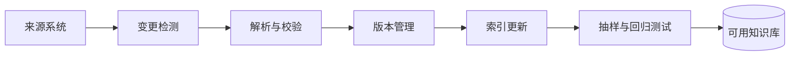
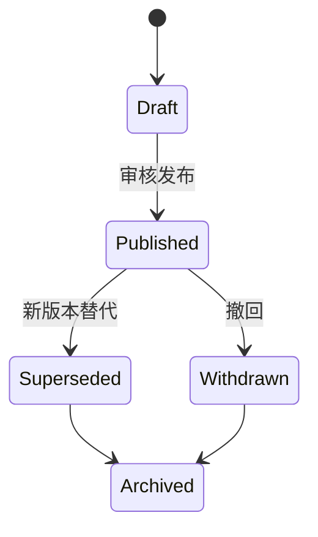

# 07｜知识库更新机制：让引用始终指向正确版本

## 1. 建库只是开始

知识库会出现新增、修改、撤回、权限变化和重复文档。若没有更新机制，RAG 很快会同时检索到新旧制度，生成互相矛盾的答案。



## 2. 文档生命周期



检索默认只返回 `Published`，历史调查才允许查询旧版本，并必须清楚标注状态。

## 3. 必要元数据

```json
{
  "document_id": "policy-expense",
  "version": "2026.07",
  "status": "published",
  "effective_from": "2026-07-01",
  "effective_to": null,
  "owner": "finance-policy-team",
  "classification": "internal",
  "allowed_groups": ["employees"],
  "source_uri": "kb://finance/policy-expense/2026.07",
  "checksum": "sha256:..."
}
```

版本、有效期、负责人、权限和校验值决定了资料是否应该进入检索结果。

## 4. 增量更新策略

- 通过 webhook、事件流或定时扫描发现变化；
- 用 checksum 判断正文是否真正改变；
- 只重建受影响的片段；
- 新索引通过验证后再切换；
- 删除时同步清除片段、缓存和派生摘要；
- 保留审计记录，但不让已撤回内容继续参与回答。

## 5. 权限变化比内容变化更危险

员工调岗或文档分类变化时，旧向量仍可能存在。应把权限校验放在查询时，而不只在索引时，并清理缓存中的旧结果。

## 6. 周报助手示例

里程碑从 7 月 25 日延期到 8 月 5 日。系统应把旧版本标记为 `superseded`，新版本生效；已经生成但未审批的周报草稿要被标记“来源已更新，需要重新核查”。

## 7. 更新后的回归测试

每次发布新版本，至少检查：新问题能命中新版本；旧版本不再进入默认回答；权限外用户无法检索；引用链接能打开正确版本；相关缓存已失效。

## 8. 常见错误

- 只追加新文档，从不撤回旧文档；
- 用文件名代替稳定文档 ID；
- 没有有效期和负责人；
- 删除原文却保留 Embedding、摘要或缓存；
- 权限只在上传时检查；
- 更新索引后没有运行回归问题集。

## 9. 完成练习

模拟一份制度文档发布新版本、撤回旧版本并修改权限。写出索引、缓存、引用和未完成草稿分别要执行的动作，并设计五个回归测试。

## 参考资料

- [OpenAI Retrieval](https://developers.openai.com/api/docs/guides/retrieval)

[← 上一篇](./06-检索增强生成.md) · [下一篇：记忆系统 →](./08-记忆系统.md)
