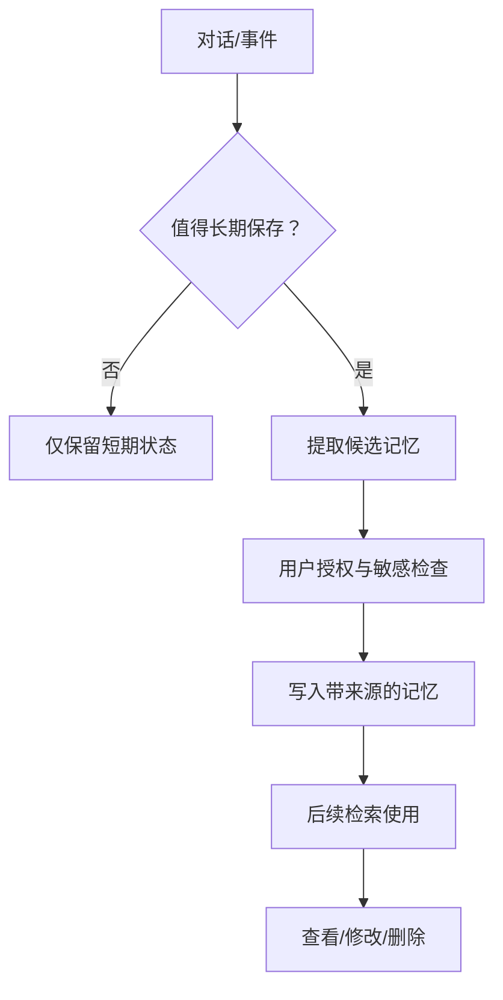
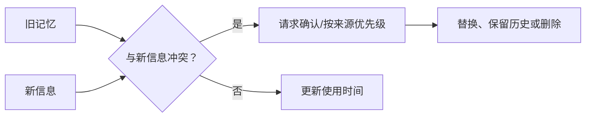

# 08｜记忆系统（Memory）：保存什么、忘记什么

## 1. 记忆不是聊天记录的无限延长

记忆系统保存跨会话仍有价值、且获得授权的信息，例如稳定偏好或长期项目背景。它不应自动保存每句话，更不能把模型推测写成事实。



## 2. 四类“记住”

| 类型 | 示例 | 是否长期 |
| --- | --- | --- |
| 工作记忆 | 本轮正在处理的草稿 | 否 |
| 任务状态 | 周报等待谁审批 | 直到任务结束 |
| 用户偏好 | 喜欢简洁中文、先结论后细节 | 可长期，需可管理 |
| 业务事实 | 项目负责人、合同状态 | 应以业务系统为准，不靠记忆 |

## 3. 记忆记录结构

```json
{
  "memory_id": "mem_102",
  "subject": "user_42",
  "type": "preference",
  "value": "周报使用简洁中文，先写结论",
  "source": "user_explicit_statement",
  "confidence": "confirmed",
  "created_at": "2026-07-20T10:00:00+08:00",
  "expires_at": null,
  "sensitivity": "low"
}
```

来源、确认状态、有效期和敏感级别能避免把旧推测永久保存。

## 4. 读写规则

写入前问：它是否稳定？未来是否有用？用户是否知道？是否包含敏感信息？是否能从权威系统实时查询？若能实时查询，就不应复制为记忆。

读取时只取与当前任务相关的少量记忆，并把“偏好”与“必须遵守的规则”分开。偏好不能覆盖安全和业务约束。

## 5. 冲突、过期与删除



用户说“以后周报不要使用表格”时，应更新旧偏好；若用户要求删除，需删除主记录、索引和相关缓存。

## 6. 周报助手示例

可以记住“负责人偏好 500 字以内”和“固定栏目顺序”；不能依赖记忆保存“当前上线日期”，因为它会变化，应每次查询项目系统。

## 7. 常见错误与安全边界

- 自动保存全部聊天；
- 把模型总结当成用户确认；
- 永不过期，也无法查看或删除；
- 使用记忆中的业务事实替代实时系统；
- 跨用户、跨租户误用记忆；
- 把敏感信息写入向量库却没有删除机制。

## 8. 完成练习

从周报场景列出 10 条候选信息，分别判断为工作记忆、任务状态、长期偏好或不得记忆，并为长期记忆设计确认、过期和删除流程。

## 参考资料

- [OpenAI Agents SDK Sessions](https://openai.github.io/openai-agents-python/sessions/)

[← 上一篇](./07-知识库更新机制.md) · [下一篇：上下文压缩 →](./09-上下文压缩与摘要.md)
