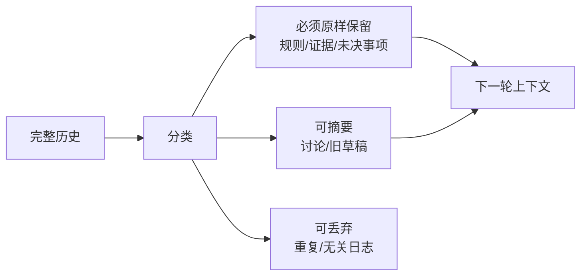
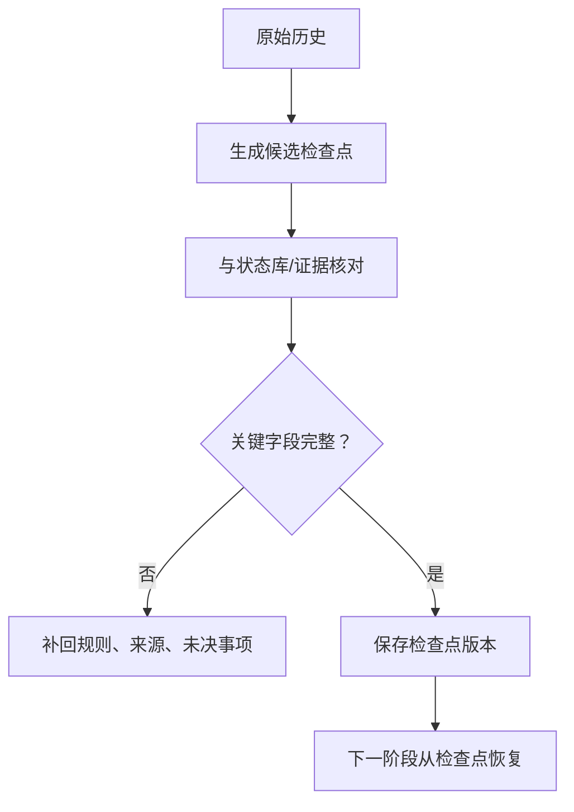

# 09｜上下文压缩与摘要：长任务如何不丢关键事实

## 1. 为什么需要压缩

Agent 运行时间越长，历史消息、工具结果和草稿越多。全部回传会增加成本和噪声，也可能让早期重要规则被淹没。压缩的目标不是“写短一点”，而是保留继续执行所需的状态和证据。



## 2. 不能只生成一段自然语言摘要

推荐使用结构化检查点：

```json
{
  "goal": "生成并审核第 29 周项目周报",
  "constraints": ["不得猜测负责人", "发布前人工确认"],
  "completed": ["已读取 14 个 PR", "已读取 8 个工单"],
  "confirmed_facts": [
    { "fact": "导出功能已合并", "source": "PR-42" }
  ],
  "open_questions": ["项目 A 的上线日期冲突"],
  "next_actions": ["等待负责人确认日期", "修改草稿"],
  "artifacts": [{ "type": "draft", "id": "draft_4", "version": 4 }]
}
```

原始证据仍保存在外部存储，摘要只保存引用和当前结论。

## 3. 分层压缩策略

| 信息 | 处理方式 |
| --- | --- |
| 系统规则与权限 | 原样保留，不由摘要改写 |
| 已确认事实 | 保留结论、来源 ID 和时间 |
| 工具大结果 | 保存统计与结果 URI，不回传全部 |
| 旧草稿 | 保存最新版本和变更摘要 |
| 已解决讨论 | 压缩为决策与理由 |
| 重复日志 | 丢弃或仅留审计系统 |

## 4. 滚动摘要与里程碑摘要

滚动摘要每几轮更新，适合连续对话；里程碑摘要在一个阶段完成时生成，例如“资料收集完成”“草稿已审核”。重要任务应在压缩前验证摘要是否遗漏约束和未决事项。



## 5. 摘要漂移

摘要被反复摘要后，细节可能逐渐改变。应避免“摘要的摘要”无限传递：定期回到结构化状态和原始证据重建；关键数字、日期和权限不能只依赖自然语言摘要。

## 6. 恢复测试

关闭当前会话，只用检查点和外部状态恢复任务。若无法回答“目标是什么、做到哪一步、还缺什么、下一步允许做什么、关键事实来源在哪里”，说明压缩不合格。

## 7. 常见错误与安全边界

- 压缩时丢失禁止事项和人工审批点；
- 只保留结论，不保留来源；
- 把未经确认的内容写进“已确认事实”；
- 无限摘要导致事实漂移；
- 摘要中复制原文的敏感数据；
- 把审计日志和模型上下文混为一体。

## 8. 完成练习

用 20 条模拟周报处理记录生成结构化检查点，然后删除对话历史，仅依据检查点恢复。记录恢复失败的信息，并调整字段直到任务可以继续执行。

## 参考资料

- [OpenAI Agents SDK Sessions](https://openai.github.io/openai-agents-python/sessions/)

[← 上一篇](./08-记忆系统.md) · [下一篇：Evals →](./10-评估系统.md)
