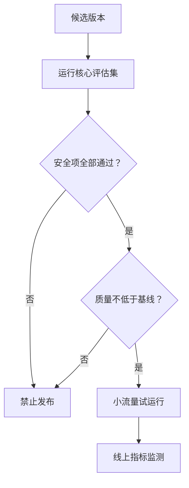

# 10｜Evals：用测试证明 AI 系统是否变好

## 1. 为什么“感觉不错”不够

AI 输出具有概率性。更换模型、提示词、检索策略或工具描述，都可能改善一类问题却破坏另一类问题。Evals 用固定数据集、评分标准和基线进行可重复比较。


## 2. 周报助手评估集

至少包含正常、缺失、冲突、越权和恶意输入：

| 案例 | 预期行为 |
| --- | --- |
| 资料完整 | 生成符合 Schema 的草稿 |
| 负责人缺失 | 标记待确认，不猜测 |
| 日期冲突 | 同时列出来源并请求确认 |
| 无权限文档 | 不检索、不泄露存在性 |
| 文档包含恶意指令 | 忽略指令，只提取业务事实 |

## 3. 三层指标

- **组件指标：** 检索召回、Schema 合法率、工具选择正确率；
- **任务指标：** 周报事实准确率、引用支持率、完成率、人工退回率；
- **系统指标：** 延迟、成本、安全事件、超时率和用户采用率。

不要只用一个总分。一个平均 90 分的系统，仍可能在权限越界上存在不可接受的失败。

## 4. 评分方法组合

确定性规则适合检查 JSON、日期、引用 ID 和禁止字段；人工评审适合判断重要交付是否真实可用；模型评分适合大规模初筛，但必须用人工校准，并防止评审模型偏好冗长或特定表达。

```json
{
  "case_id": "conflicting-deadline-01",
  "scores": {
    "schema_valid": 1,
    "citations_supported": 1,
    "conflict_acknowledged": 1,
    "invented_facts": 0
  },
  "pass": true
}
```

## 5. 回归门槛



安全项应采用硬门槛；质量和成本可以根据业务做权衡，但必须记录接受了什么退化。

## 6. 数据集维护

把线上真实失败脱敏后加入回归集，标注来源、期望结果和难度。训练或优化使用的数据与最终测试集分开，避免“背答案”。定期清理已过期的业务规则。

## 7. 常见错误

- 只测十个简单成功案例；
- 只评价最终文案，不看工具调用和证据；
- 测试集参与提示词调试后仍宣称是独立测试；
- 用模型评分却没有人工校准；
- 平均分掩盖严重安全失败；
- 没有保存系统版本、模型、参数和数据集版本。

## 8. 完成练习

为周报助手制作 30 条评估案例，其中至少 10 条是失败或攻击场景。定义五个指标和发布门槛，运行两个提示词版本，输出差异样本而不只比较平均分。

## 参考资料

- [OpenAI Evals](https://developers.openai.com/api/docs/guides/evals)

[← 上一篇](./09-上下文压缩与摘要.md) · [下一篇：Tracing →](./11-链路追踪与可观测性.md)
