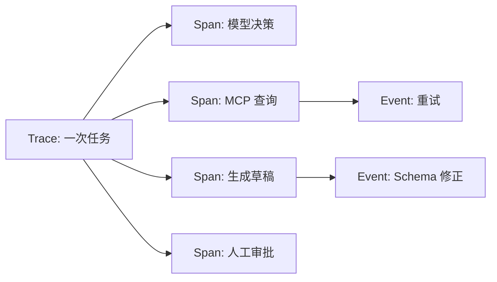
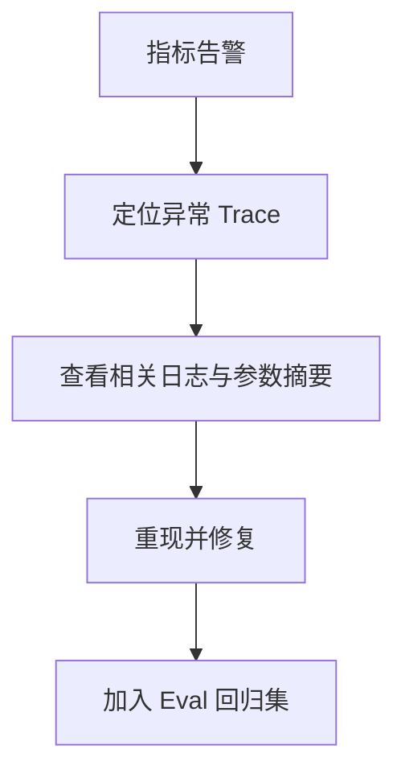

# 11｜Tracing 与可观测性：看清智能体在哪一步失败

## 1. 日志不等于 Trace

日志是单个事件；Trace 把一次用户任务中的模型请求、工具调用、审批和结果串成完整调用链。没有 Trace，只看到“周报生成失败”，却不知道是检索无结果、工具超时、Schema 错误还是审批过期。



## 2. 应记录什么

| 层级 | 示例字段 |
| --- | --- |
| Trace | task_id、用户范围、系统版本、开始/结束时间 |
| 模型 Span | 模型、Token、延迟、结果状态，不记录不必要敏感原文 |
| 工具 Span | 工具名、参数摘要、权限结果、request_id、重试次数 |
| 审批 Span | 审批人、版本、决定、理由、等待时间 |
| 结果 | 完成/失败/取消、质量指标、成本 |

## 3. 关联 ID

同一个 `trace_id` 应贯穿 API、队列、MCP、业务服务和审计日志；每个步骤使用 `span_id`，工具返回保留其 `request_id`。

```json
{
  "trace_id": "tr_9021",
  "span_id": "sp_tool_07",
  "parent_span_id": "sp_agent_03",
  "operation": "list_merged_prs",
  "status": "timeout",
  "retryable": true,
  "duration_ms": 5021
}
```

## 4. 指标、日志、Trace 的分工

- 指标告诉你“失败率从 2% 升到 8%”；
- 日志告诉你“工具返回 429”；
- Trace 告诉你“哪类任务在哪个工具、哪个版本发生 429，并触发了几次重试”。



## 5. 隐私与保留

可观测性系统往往比业务系统收集更多信息。默认不记录完整提示词、密钥、个人身份信息和工具原始返回；使用脱敏、字段白名单、访问控制和保留期限。调试模式也不能无限期保存生产数据。

## 6. 周报助手排错例子

用户说“漏了三个 PR”。Trace 显示模型只收到 10 条结果，MCP 工具返回 `next_cursor`，但 Agent 没有继续分页。根因不是模型总结能力，而是工具循环没有处理分页。修复后把“多页 PR”加入评估集。

## 7. 常见错误

- 只记录最终错误文本；
- Trace ID 没有跨服务传递；
- 不记录系统、提示词和工具版本；
- 为调试保存完整敏感输入；
- 只收集数据，没有告警和排错流程；
- 发现失败后未沉淀为回归评估。

## 8. 完成练习

画出一次周报生成的完整 Trace，至少包含两个模型 Span、三个工具 Span 和一个审批 Span。设计一个“PR 缺失”的排错过程，并列出哪些字段允许记录、哪些必须脱敏。

## 参考资料

- [OpenAI Agents SDK Tracing](https://openai.github.io/openai-agents-python/tracing/)

[← 上一篇](./10-评估系统.md) · [下一篇：Human-in-the-loop →](./12-人工参与机制.md)
