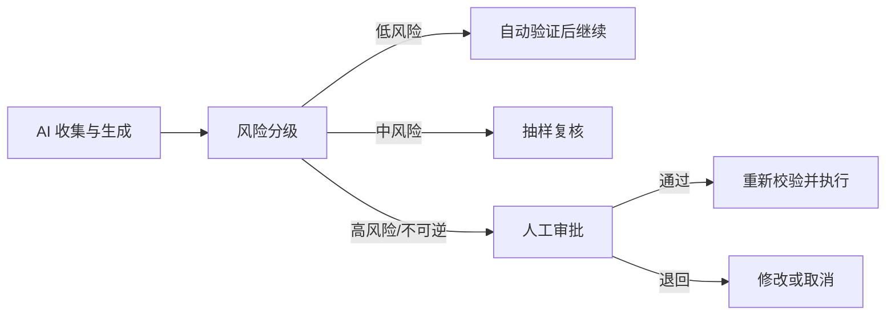
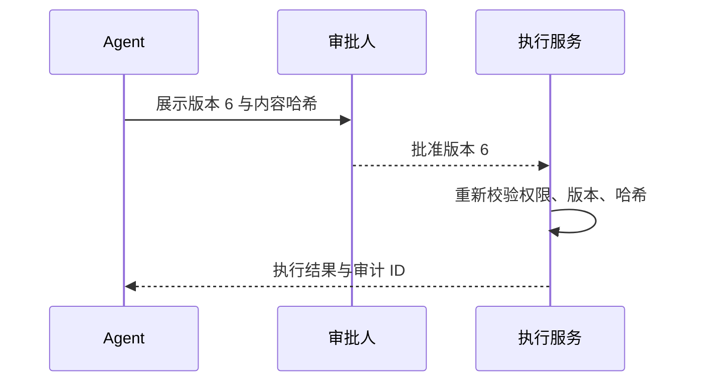

# 12｜Human-in-the-loop：把人放在真正需要负责的位置

## 1. 人工确认不是失败兜底

Human-in-the-loop（HITL）是在流程设计阶段明确哪些动作必须由人判断、补充或批准。它不是让人重新做全部工作，而是把注意力放在高影响、不确定和不可逆环节。



## 2. 哪些情况必须有人

- 发送、发布、删除、付款和修改生产数据；
- 涉及法律、医疗、金融、招聘或人员权益；
- 事实冲突、来源不足或模型不确定；
- 影响范围突然扩大；
- 工具请求超出常规参数或权限。

## 3. 好的审批界面展示什么

审批人应看到：准备执行的动作、目标对象、关键参数、证据来源、内容差异、风险提示、可撤销性和请求版本。只显示“是否同意 AI 操作？”没有决策价值。

```json
{
  "action": "publish_weekly_report",
  "audience": "研发部门 42 人",
  "draft_version": 6,
  "changes_since_last_review": ["更新项目 A 上线日期"],
  "open_questions": [],
  "reversible": false,
  "expires_at": "2026-07-20T18:00:00+08:00"
}
```

## 4. 防止“批准后内容被替换”

审批必须绑定精确版本或内容哈希。批准后执行前再次校验：审批未过期、用户权限仍有效、内容未变化、目标范围未扩大。



## 5. 审批疲劳

如果每个只读查询都要求批准，人会快速机械点击。应按风险分级：低风险动作使用规则和抽样，高风险动作保留明确审批；相同批次可合并展示，但不能隐藏单项影响。

## 6. 周报助手例子

AI 可以自动收集只读数据、生成草稿和运行格式检查；负责人必须确认事实冲突和最终版本；发送给部门属于不可逆外部动作，执行前再次展示收件范围和内容摘要。

## 7. 常见错误

- 审批发生在动作执行之后；
- 审批页没有来源、差异和影响范围；
- 批准草稿 A，系统却发送更新后的草稿 B；
- 审批永不过期；
- 低风险操作过度审批导致疲劳；
- 把人工审批当作替代权限、校验和日志的万能措施。

## 8. 完成练习

为周报助手建立风险矩阵，把所有工具分成自动、抽样复核和强制审批三类；设计发布审批对象，并验证内容或收件范围改变后旧审批自动失效。

## 参考资料

- [OpenAI Agents SDK Human-in-the-loop](https://openai.github.io/openai-agents-python/human_in_the_loop/)

[← 上一篇](./11-链路追踪与可观测性.md) · [下一篇：Guardrails →](./13-安全护栏.md)
