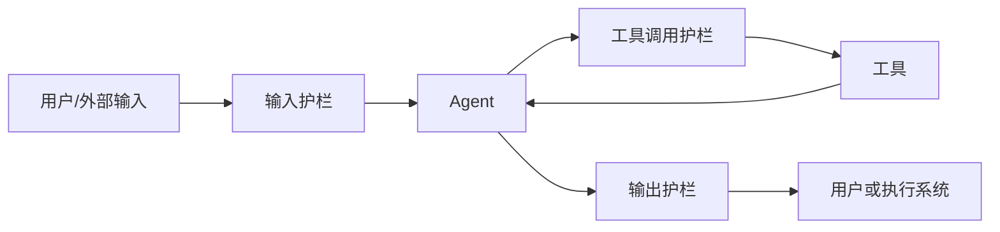
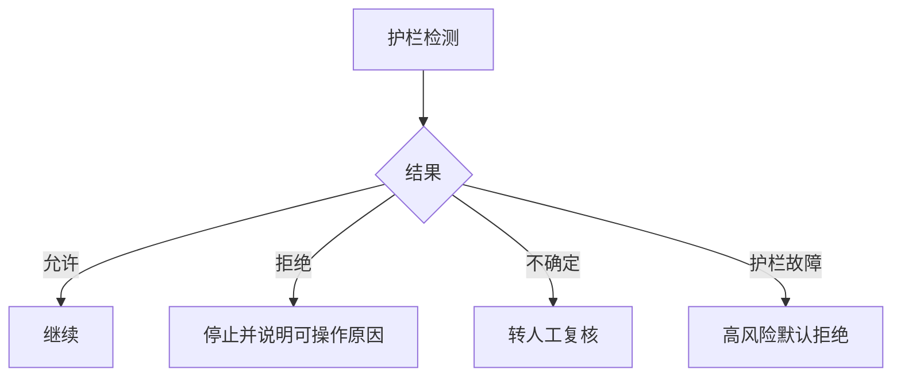

# 13｜Guardrails：在输入、执行与输出三处设防

## 1. 护栏不是一句“请确保安全”

Guardrails 是确定性规则、分类模型、业务校验与人工审批的组合。它们应分布在输入、工具调用和输出三个阶段，不能只依赖主模型自我检查。



## 2. 三层护栏

| 层级 | 检查内容 | 例子 |
| --- | --- | --- |
| 输入 | 数据类型、敏感信息、越权意图、大小 | 拒绝上传访问令牌 |
| 工具 | 权限、参数、状态机、副作用、频率 | 发布工具必须有审批令牌 |
| 输出 | Schema、事实引用、敏感字段、政策 | 周报不得包含客户手机号 |

## 3. 规则按失败方式选择

精确格式使用 JSON Schema；权限使用服务端 ACL；敏感字段使用白名单和检测；语义风险可用分类模型；重大决策使用人工审批。不要用一个模型提示同时承担全部责任。

## 4. 周报发布护栏示例

```ts
function canPublish(ctx: PublishContext): Decision {
  if (!ctx.user.permissions.includes("report:publish")) return deny("无发布权限");
  if (!ctx.approval || ctx.approval.version !== ctx.draft.version) return deny("审批无效");
  if (ctx.draft.openQuestions.length > 0) return deny("仍有待确认项");
  if (containsSensitiveData(ctx.draft.content)) return deny("检测到敏感信息");
  return allow();
}
```

## 5. 失败模式要明确



高风险写操作应 fail closed；低风险辅助生成可以降级为只读或草稿模式。

## 6. 护栏测试

测试正常输入、边界值、编码变体、超长内容、嵌套数据、恶意指令、权限变化和护栏服务故障。还要检查误拦截率，否则用户会绕开系统。

## 7. 常见错误

- 只在提示词中写规则；
- 把主模型的“自我反思”当确定性安全保证；
- 所有风险都直接拒绝，没有人工通道；
- 护栏失败时高风险动作仍继续；
- 不记录拦截原因和规则版本；
- 只测明显攻击，不测编码和组合绕过。

## 8. 完成练习

为周报助手分别写出五条输入、工具和输出护栏，标注其实现方式、失败处理和责任人；再设计十个绕过测试。

## 参考资料

- [OpenAI Agents SDK Guardrails](https://openai.github.io/openai-agents-python/guardrails/)

[← 上一篇](./12-人工参与机制.md) · [下一篇：Prompt Injection →](./14-提示词注入防护.md)
