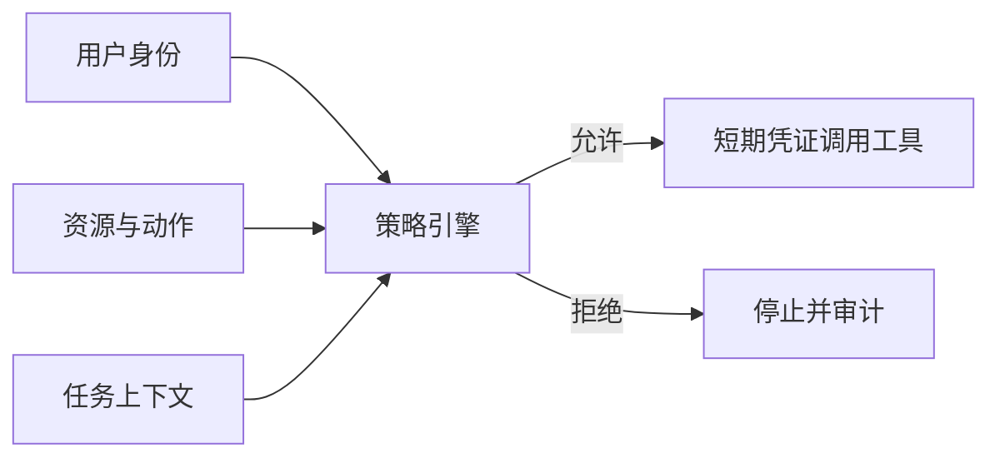
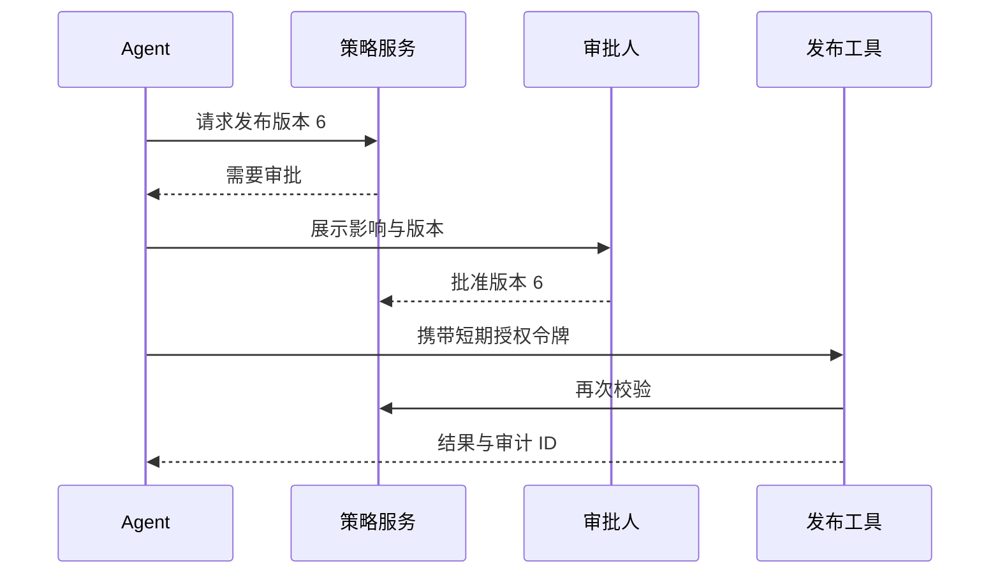

# 15｜权限、审计与密钥管理

## 1. Agent 的权限不能大于用户

认证回答“你是谁”，授权回答“你能对哪个资源做什么”。Agent 代表用户执行时，必须继承或收窄用户权限，不能因为服务账号权限较大就绕过业务规则。



## 2. 最小权限设计

按动作拆分 `report:read`、`report:draft:create`、`report:approve`、`report:publish`；读取项目 A 不代表能读取项目 B；发布到测试空间不代表能发布到全公司。

## 3. 凭证管理

- 密钥存入专用密钥管理系统，不写进提示词、代码或日志；
- 使用短期、可撤销凭证；
- 不同环境、服务和权限使用不同身份；
- 定期轮换并监控异常使用；
- 工具只接收必要授权上下文，不向模型暴露令牌。

## 4. 审计日志

```json
{
  "event_id": "audit_8841",
  "actor": "user_42",
  "agent_version": "weekly-agent-1.8",
  "action": "report.publish",
  "resource": "report_2026_w29_v6",
  "decision": "allowed",
  "policy_version": "policy-12",
  "approval_id": "approval_551",
  "trace_id": "tr_9021",
  "timestamp": "2026-07-20T17:40:00+08:00"
}
```

日志应防篡改、限制访问并设保留期；不要记录密钥和不必要的完整内容。

## 5. 发布权限流程



## 6. 紧急撤销

应能禁用工具、撤销服务身份、终止任务和阻断外部目的地。发生疑似泄露时，先控制影响范围，再调查 Trace；不要等完整原因分析后才撤销权限。

## 7. 常见错误

- 所有工具共用管理员密钥；
- 权限只在 UI 检查，后端接口不检查；
- 把 API Key 放入模型上下文；
- 日志记录完整令牌或敏感材料；
- 审批人与执行版本没有绑定；
- 无法快速禁用 Agent 的外部访问。

## 8. 完成练习

为周报助手设计权限矩阵，覆盖成员、负责人、管理员和 Agent 服务身份。模拟用户被移出项目后仍尝试发布，并验证策略拒绝、凭证撤销和审计记录。

## 参考资料

- [NIST AI Risk Management Framework](https://www.nist.gov/itl/ai-risk-management-framework)

[← 上一篇](./14-提示词注入防护.md) · [下一篇：重试与幂等 →](./16-重试超时幂等与补偿.md)
