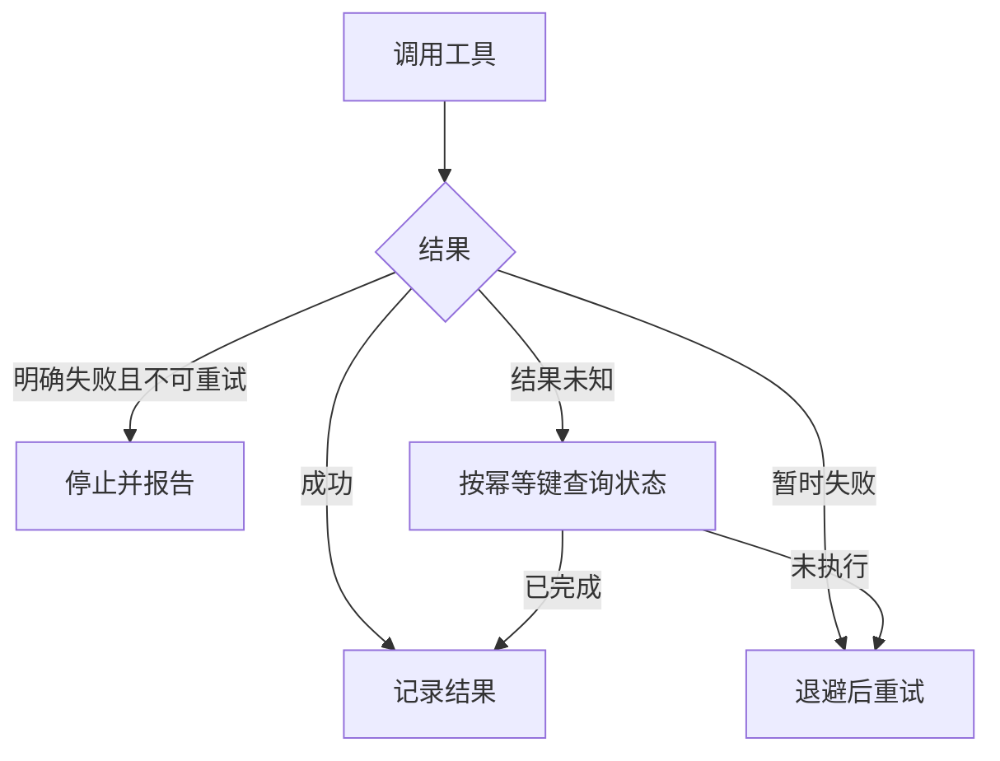
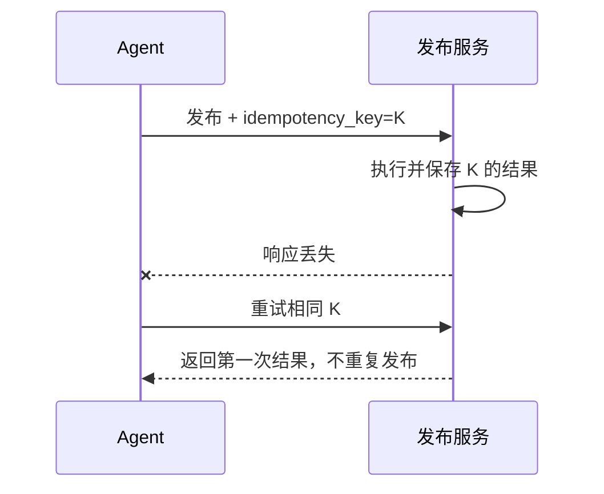

# 16｜重试、超时、幂等与补偿

## 1. 网络失败不代表操作没有发生

发布请求超时，可能是服务器没有收到，也可能已经成功但响应丢失。若直接重试，就可能发布两次。可靠系统需要把暂时失败、永久失败和结果未知分开。



## 2. 超时分层

连接超时、单次工具超时、整轮 Agent 超时和业务截止时间不是同一个概念。内层超时应短于外层预算，并预留清理和记录时间。

## 3. 重试策略

只重试可能恢复的错误，例如 429、部分 5xx 和短暂网络中断。使用指数退避、随机抖动和最大次数；参数错误、权限拒绝和业务冲突不应自动重试。

```ts
const retryPolicy = {
  maxAttempts: 4,
  baseDelayMs: 500,
  maxDelayMs: 8000,
  retryable: ["rate_limited", "temporary_unavailable", "network_error"]
};
```

## 4. 幂等键

相同业务动作使用稳定幂等键，例如 `publish:project-a:2026-w29:v6`。服务端第一次执行后保存结果，重复请求返回同一结果，而不是再次执行。



## 5. 补偿而不是假装回滚

某些外部动作无法真正回滚，例如邮件已发送。补偿操作可能是发送更正通知、标记旧版本无效或创建人工处理任务。Saga 流程应为每一步定义补偿及其失败处理。

## 6. 周报助手例子

发布前创建草稿可以安全重试；发布本身使用幂等键；若发布后发现错误，不能删除收件人的已读邮件，只能生成更正版本并记录事件。

## 7. 常见错误

- 所有错误都重试；
- 重试没有上限和抖动；
- 每次重试生成新的幂等键；
- 超时后直接假设失败；
- Agent 重启后丢失已执行结果；
- 把不可逆动作描述为“可回滚”。

## 8. 完成练习

模拟发布请求已成功但响应丢失，验证相同幂等键不会重复发布。再为“草稿创建—审批—发布”每一步定义超时、重试、幂等和补偿策略。

## 参考资料

- [Microsoft Azure Architecture Center：Retry pattern](https://learn.microsoft.com/azure/architecture/patterns/retry)

[← 上一篇](./15-权限审计与密钥管理.md) · [下一篇：成本与性能 →](./17-成本与性能优化.md)
