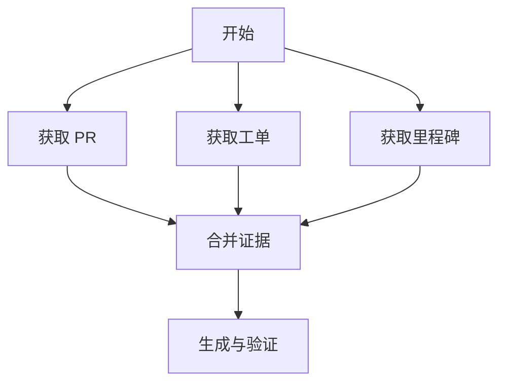

# 17｜成本与性能优化：不牺牲质量地提高效率

## 1. 先测量，再优化

AI 系统成本来自模型 Token、检索、工具、存储和人工审核；延迟来自模型推理、串行工具调用、队列和外部系统。优化前应通过 Trace 找到真正瓶颈。

## 2. 三角权衡

质量、速度和成本通常不能同时最大化。发布前事实核查不能为了节省几秒删除；草稿润色则可用更便宜的模型或异步执行。

## 3. 模型路由

| 任务 | 路由策略 |
| --- | --- |
| 分类、格式修正 | 小而快的模型 |
| 复杂规划、冲突分析 | 能力更强的模型 |
| 高风险审核 | 强模型 + 规则 + 人工 |
| 批量离线摘要 | 批处理、低优先级队列 |

路由要基于评估集，不要只凭模型名称或单个示例。

## 4. 减少上下文浪费

- 检索只返回相关 Top-K；
- 大工具结果存外部，只传摘要和引用；
- 使用结构化检查点替代全部历史；
- 删除重复规则和无关示例；
- 对稳定前缀使用支持的缓存机制；
- 保留质量回归测试，防止“压缩过头”。

## 5. 并行与关键路径

相互独立的只读查询可以并行；存在依赖、共享写状态或外部限流时应串行或限制并发。

## 6. 缓存安全

缓存键必须包含用户/租户、权限范围、资料版本和系统版本。不能把有权限用户的检索结果返回给无权限用户；敏感内容应设短保留期和删除传播机制。

## 7. 周报助手指标

记录 P50/P95 延迟、每任务 Token 与费用、工具调用数、缓存命中率、人工审核时间、事实准确率和退回率。成本下降但退回率上升，不算优化成功。

## 8. 常见错误

- 只优化 Token，不看人工返工；
- 并行调用存在顺序依赖的写工具；
- 缓存忽略权限和文档版本；
- 为降低延迟跳过事实验证；
- 路由到小模型却没有回归测试；
- 只看平均延迟，不看 P95 和超时。

## 9. 完成练习

为周报助手建立一次任务的成本和延迟分解，找出最大两项；提出一种上下文优化、一种并行优化和一种路由优化，并用 Eval 确认质量不下降。

## 参考资料

- [OpenAI Prompt Caching](https://developers.openai.com/api/docs/guides/prompt-caching)

[← 上一篇](./16-重试超时幂等与补偿.md) · [下一篇：Workflow 与 Agent →](./18-工作流与智能体.md)
