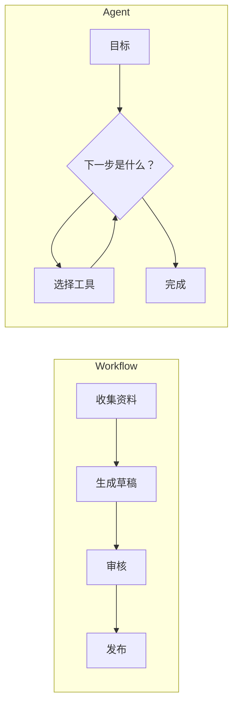
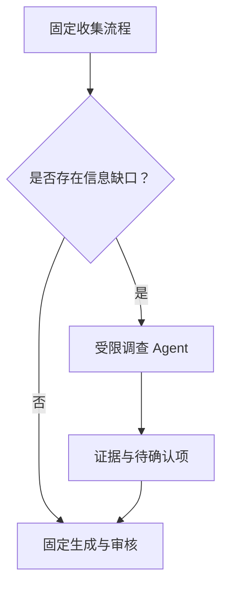

# 18｜Workflow 与 Agent：先确定性，后自主性

## 1. 核心区别

Workflow 的步骤由开发者预先规定；Agent 根据目标和状态动态选择下一步。Agent 更灵活，但更难测试、预测和控制。

## 2. 选择标准

| 问题 | Workflow | Agent |
| --- | --- | --- |
| 步骤是否稳定 | 是 | 否 |
| 是否需要动态探索 | 少 | 多 |
| 错误代价 | 高时更合适 | 需严控 |
| 测试难度 | 较低 | 较高 |
| 典型任务 | 审批、报表、数据同步 | 调研、复杂排错、开放规划 |

## 3. 混合架构

周报主流程使用 Workflow；“查找延期原因”这类开放子任务可以交给受限 Agent。Agent 只能使用只读工具，返回证据与候选结论，再回到固定审批流程。

## 4. 自主性升级阶梯

1. 固定模板；
2. 固定 Workflow；
3. Workflow 中一个受限 Agent 节点；
4. 多工具 Agent，但有步数与审批；
5. 高自主系统，仅用于风险可控且评估充分的场景。

## 5. 常见错误

- 简单数据管道也使用 Agent；
- 把所有异常交给模型自由处理；
- Agent 没有工具白名单、预算和停止条件；
- Workflow 写死到无法处理正常业务分支；
- 用“更智能”代替明确的收益指标。

## 6. 完成练习

把周报流程拆成确定步骤与开放步骤，只选择一个开放步骤使用 Agent，写出其工具、预算、完成条件和回到 Workflow 的输出格式。

## 参考资料

- [OpenAI Agents SDK](https://openai.github.io/openai-agents-python/)

[← 上一篇](./17-成本与性能优化.md) · [下一篇：多智能体 →](./19-多智能体与任务交接.md)
