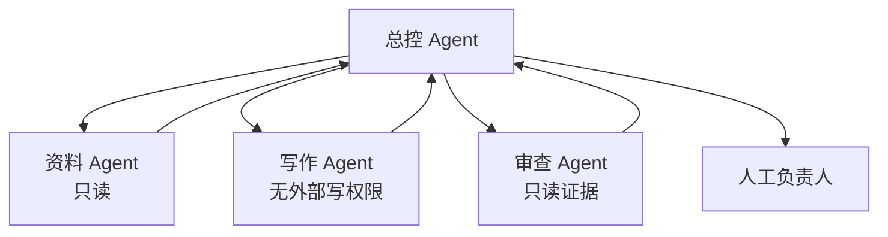

# 19｜多智能体与 Handoff

## 1. 多智能体不是“角色越多越专业”

多智能体适合任务可以独立拆分、上下文彼此干扰或需要专门权限的情况。它的成本是交接、重复工作、状态同步和责任模糊。



## 2. Handoff 合同

交接不能只说“请继续”。应包含目标、已完成内容、输入来源、未决问题、允许工具、预算和期望输出。

```json
{
  "task": "核查周报成果条目",
  "inputs": ["draft_6", "source_set_29"],
  "completed": ["格式检查已通过"],
  "open_questions": ["上线日期冲突"],
  "allowed_tools": ["read_pr", "read_ticket"],
  "output_schema": "review_findings_v2"
}
```

## 3. 并行与串行

独立检索可以并行；写作依赖资料结果，审查依赖草稿，因此必须串行。多个 Agent 不应同时修改同一个草稿，除非有版本合并规则。

## 4. 责任归属

每个 Agent 对局部产物负责，总控负责整合，但最终业务责任仍由人承担。审查 Agent 不能给自己生成的内容“盖章”；关键审查应使用独立上下文和证据。

## 5. 常见错误

- 为简单任务创建大量角色；
- 所有 Agent 共享管理员工具；
- 交接丢失来源和未决事项；
- 多个 Agent 同时写同一状态；
- 失败后循环转交；
- 只统计 Agent 数量，不比较质量、延迟和成本。

## 6. 完成练习

将周报分为资料、写作、核查三类子任务，设计每个 Agent 的输入、输出和权限；画出依赖图，并说明哪些任务可以并行。

## 参考资料

- [Codex Subagents](https://learn.chatgpt.com/docs/agent-configuration/subagents)
- [OpenAI Agents SDK Handoffs](https://openai.github.io/openai-agents-python/handoffs/)

[← 上一篇](./18-工作流与智能体.md) · [下一篇：计划与反思 →](./20-计划反思与批判机制.md)
