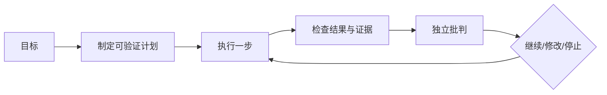
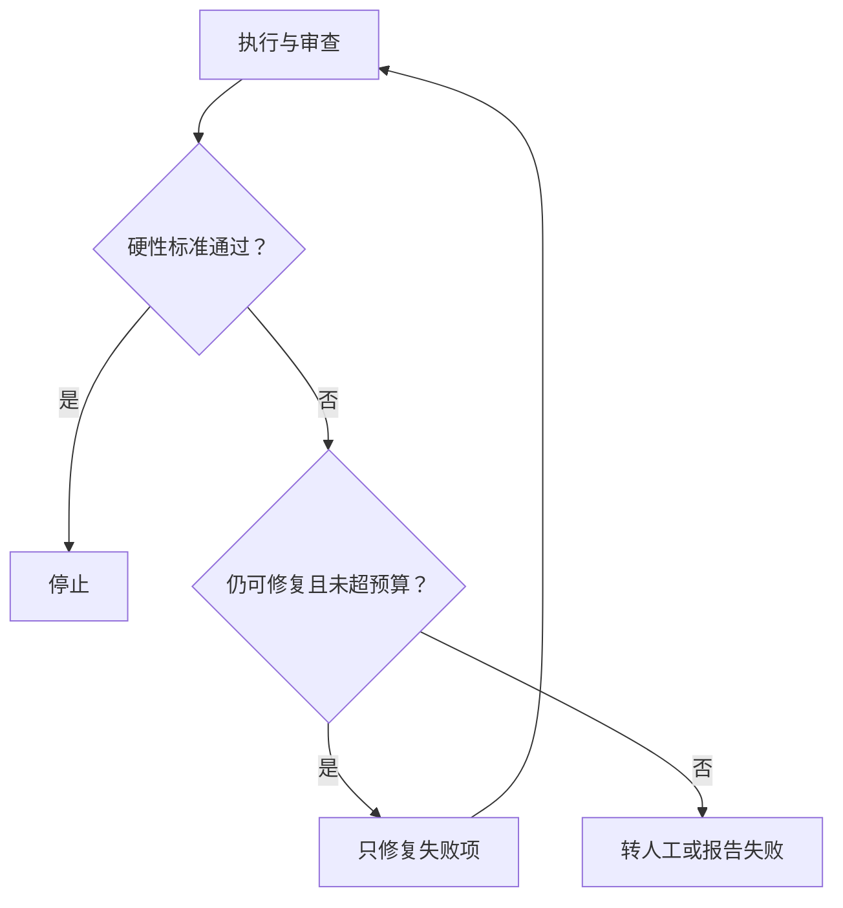

# 20｜计划、反思与批判机制

## 1. 三个阶段

计划把目标拆成步骤；反思比较预期与实际；批判从独立角度寻找证据缺口。它们能提高复杂任务质量，但也会增加 Token、延迟和循环风险。

## 2. 好计划的结构

每一步包含产物、工具、依赖、完成标准和失败处理。避免“研究一下、优化一下”这类无法验收的步骤。

## 3. 反思应基于证据

不要只问模型“你做得好吗”。应比较 Schema、来源覆盖、评估规则和工具结果。例如：计划要求覆盖所有已合并 PR，Trace 显示分页只读取一页，反思结论才有依据。

## 4. 独立批判

批判角色只获得草稿、任务标准和原始证据，不读取写作 Agent 的详细思维过程，避免继承同一偏见。输出应是具体问题、证据和修改建议，而不是重新写一份全文。

## 5. 循环控制

## 6. 常见错误

- 让同一模型无证据地自我表扬；
- 每轮都重写全部内容；
- 没有最大循环次数；
- 批判意见没有严重级别和定位；
- 为简单任务增加昂贵反思链；
- 把模型的内部推理当作必须存储的审计证据。

## 7. 完成练习

为周报任务写五步计划，每步定义产物与完成条件。创建一份故意漏掉分页数据的草稿，让批判角色通过 Trace 和来源覆盖规则发现问题，并限制最多两轮修复。

## 参考资料

- [OpenAI Agents SDK Agents](https://openai.github.io/openai-agents-python/agents/)

[← 上一篇](./19-多智能体与任务交接.md) · [下一篇：Computer Use →](./21-计算机操作与浏览器自动化.md)
