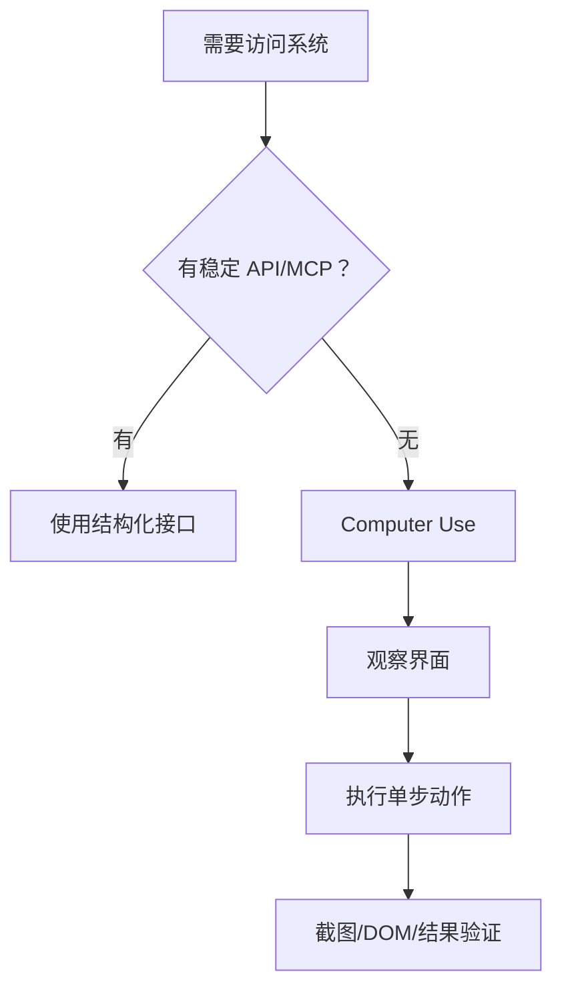
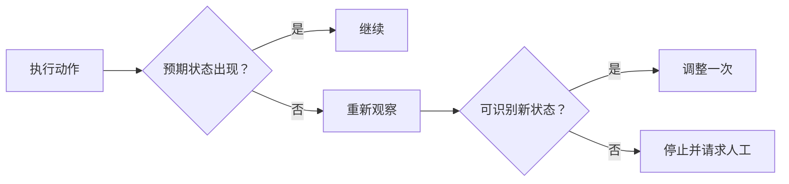

# 21｜Computer Use 与浏览器自动化

## 1. 什么时候使用

优先使用稳定 API 或 MCP；当目标系统没有接口、必须操作网页或桌面应用时，再使用 Computer Use。界面自动化容易受布局、弹窗、登录状态和网络影响。

## 2. 观察—动作—验证

每个关键动作后重新观察，不能假设点击成功。导航、输入、提交和下载应分别验证页面标题、URL、提示信息或下载文件。

## 3. 周报场景

旧项目门户没有 API。Agent 可以登录后读取本周里程碑页面并保存截图证据；但最终发布周报前，应展示内容与接收范围，由负责人点击确认。

## 4. 安全控制

- 站点域名白名单；
- 隔离浏览器配置和最小账号权限；
- 密码由凭证系统填写，不进入模型上下文；
- 下载文件先扫描和分类；
- 外部页面文本视为不可信；
- 发送、购买、删除、授权等动作强制确认；
- 记录关键截图和操作 Trace，但遮盖敏感字段。

## 5. 界面变化与恢复

## 6. 常见错误

- 有 API 仍依赖像素点击；
- 连续执行多步却不验证；
- 使用个人高权限浏览器配置；
- 页面注入诱导 Agent 外传数据；
- 页面变化后无限试错；
- 截图日志泄露敏感信息。

## 7. 完成练习

在测试网站实现“打开页面—读取一条数据—保存草稿”的流程，为每步写验证条件；模拟按钮改名和弹窗，确认系统能停止并报告，而不是随机点击。

## 参考资料

- [Codex Computer Use](https://learn.chatgpt.com/docs/computer-use)

[← 上一篇](./20-计划反思与批判机制.md) · [下一篇：后台任务 →](./22-后台任务与长时间运行.md)
