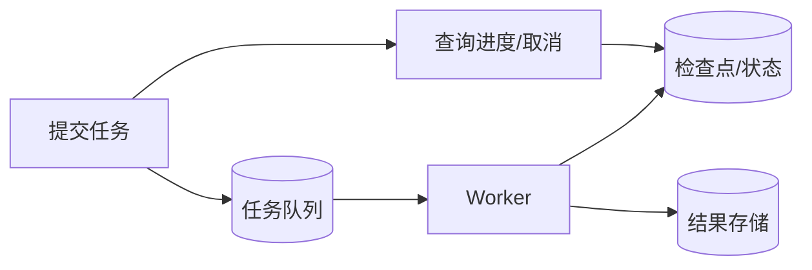
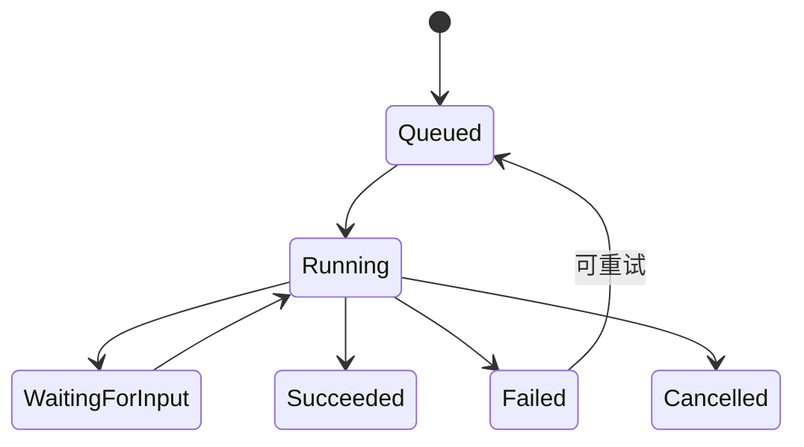

# 22｜后台任务与长时间运行

## 1. 为什么不能一直占着一次请求

深度检索、批量文档处理和代码构建可能持续数分钟或数小时。应把它们变成可查询、可取消、可恢复的后台任务。

## 2. 任务状态

`queued → running → waiting_for_input → succeeded / failed / cancelled`。每个状态包含进度摘要、当前阶段、可恢复检查点、错误分类和更新时间。

## 3. 周报批量任务

系统为 20 个项目生成周报。每个项目是独立子任务；单个失败不应让全部重做。完成后只通知结果摘要，敏感内容仍留在获授权系统。

## 4. 恢复、取消和租约

Worker 使用租约防止同一任务被并发执行；定期心跳。崩溃后新 Worker 从检查点恢复。取消请求应在安全边界生效：停止未执行步骤，但已发送邮件无法撤回。

## 5. 进度不是随便写百分比

优先展示阶段与已完成数量，例如“已处理 13/20 个项目，正在核查项目 N”；若各步骤耗时不均，不要用简单步骤数伪造精确百分比。

## 6. 常见错误

- 把长任务放在同步 HTTP 请求中；
- 重启后丢失状态；
- 任务重复消费却没有幂等；
- 无取消、超时和资源上限；
- 在通知中泄露完整结果；
- 一个子任务失败导致全部重跑。

## 7. 完成练习

把 20 个项目周报设计成父任务和子任务，定义状态、检查点、重试、取消和最终通知。模拟 Worker 在第 13 个项目崩溃，验证只恢复未完成部分。

## 参考资料

- [OpenAI Background mode](https://developers.openai.com/api/docs/guides/background)

[← 上一篇](./21-计算机操作与浏览器自动化.md) · [下一篇：插件封装 →](./23-插件与应用封装.md)
