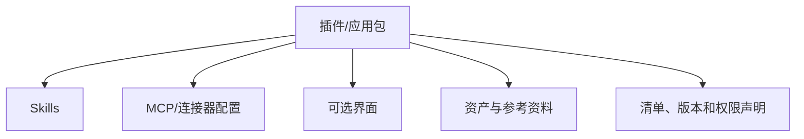

# 23｜插件与应用封装

## 1. 从个人流程到可安装能力

当 Skill、MCP 配置、工具、界面和安全说明需要供团队复用时，可封装为插件或应用。封装要解决版本、依赖、权限、安装和升级，而不只是把文件压缩在一起。

## 2. 包中应包含什么

- 清晰的用途、触发场景和限制；
- Skill 与参考资料；
- 外部连接依赖和认证方式；
- 所需权限与数据流说明；
- 版本、变更记录和兼容范围；
- 安装后的验收与卸载方法。

## 3. 周报插件示例

插件包含 weekly-report Skill、项目系统 MCP 配置、草稿预览界面和安全检查清单。安装时只申请读取项目和创建草稿；发布权限作为可选、独立授权。

## 4. 版本与升级

新增权限、改变数据目的地或引入写工具属于重大变更，不能静默升级。

## 5. 常见错误

- 安装时申请所有权限；
- Skill 依赖的 MCP 未声明；
- 没有版本和升级说明；
- 把密钥放入包内；
- 卸载后仍保留令牌或后台任务；
- 将内部资料误打包公开发布。

## 6. 完成练习

为周报能力写一个插件清单：组件、依赖、权限、配置、验收、升级和卸载。假设新版本增加发布工具，说明为何必须重新获得授权。

## 参考资料

- [Codex Plugins](https://learn.chatgpt.com/docs/plugins)
- [Codex Skills](https://learn.chatgpt.com/docs/build-skills)

[← 上一篇](./22-后台任务与长时间运行.md) · [下一篇：Hooks →](./24-钩子与策略执行.md)
