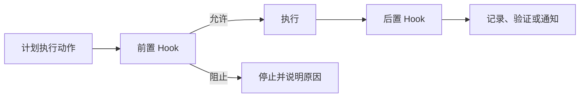
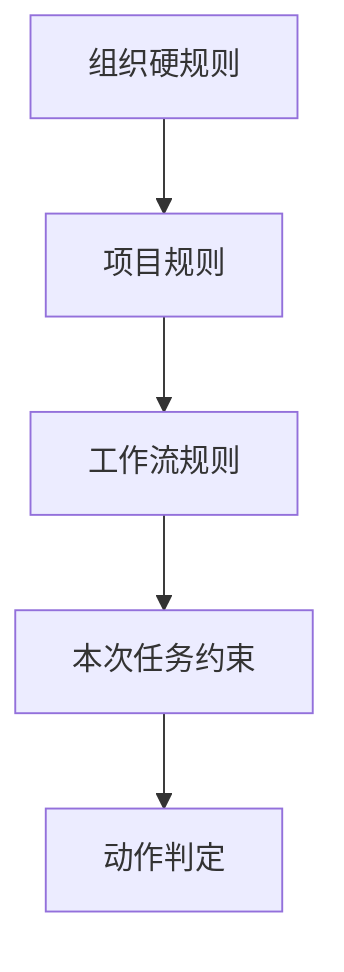

# 24｜Hooks 与策略执行

## 1. Hook 适合机械、确定的规则

Hook 在工具调用、命令执行、提交或发布前后自动触发检查。它适合强制秘密扫描、格式验证、测试和策略记录，不适合用来替代需要语义判断的完整业务审批。

## 2. 周报流程中的 Hook

- 创建草稿前检查输入是否包含明显密钥；
- 发布前验证 Schema、审批版本和待确认项；
- 发布后记录审计 ID 并验证目标系统状态；
- 提交文章前检查 Markdown 链接和代码围栏。

## 3. Hook 设计原则

Hook 要快速、确定、可观察；失败信息说明具体修复方式；有超时和版本；高风险前置检查故障时默认阻止；不要让 Hook 悄悄修改用户内容。

## 4. 策略层次

下层不能放宽上层硬规则。策略决策应记录使用的规则版本。

## 5. 常见错误

- Hook 执行太慢导致所有操作阻塞；
- 高风险 Hook 失败时默认放行；
- Hook 具有超过被检查动作的权限；
- 规则散落且无版本；
- 自动修改内容却没有差异记录；
- 把所有语义审查都塞进 Hook。

## 6. 完成练习

设计一个发布前 Hook：输入为草稿、审批和用户身份，输出为允许/拒绝及原因。覆盖缺少审批、版本不一致、待确认未清零和 Hook 超时四种测试。

## 参考资料

- [Codex Hooks](https://learn.chatgpt.com/docs/hooks)

[← 上一篇](./23-插件与应用封装.md) · [下一篇：多模态 AI →](./25-多模态人工智能.md)
