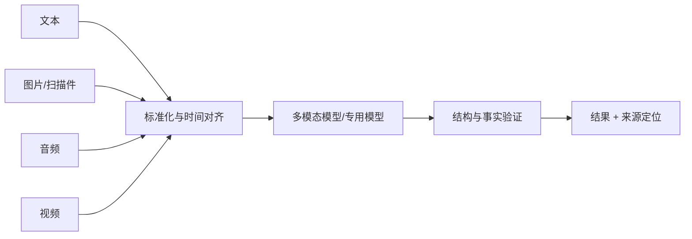
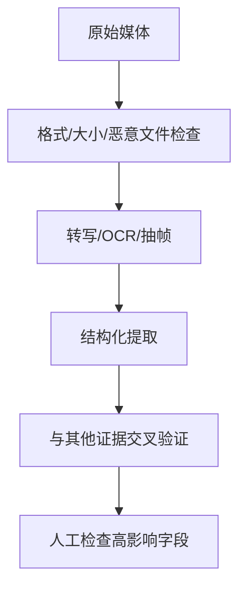

# 25｜多模态 AI：联合处理文字、图片、音频与视频

## 1. 多模态不是简单“上传图片”

多模态系统需要决定输入如何采集、解析、对齐、验证和保存。图片识别、音频转写和视频抽帧都会引入新的错误与隐私风险。

## 2. 场景选择

| 场景 | 输入 | 关键验证 |
| --- | --- | --- |
| 票据识别 | 图片/PDF | 金额、日期、币种与原图位置 |
| 会议总结 | 音频 + 议程 | 说话人、时间戳、关键决定 |
| 截图排错 | 截图 + 日志 | UI 状态与日志时间是否对应 |
| 视频质检 | 视频抽帧 | 抽帧覆盖率和事件时间 |

## 3. 周报助手示例

会议录音先转写并标注时间戳，再与议程、工单对齐。周报中的决策要引用原始录音时间段或确认后的纪要；模型无法确认说话人时必须标记待确认。

## 4. 分阶段处理

专用 OCR、语音识别和业务规则往往比让一个模型包办全部流程更容易测试。

## 5. 隐私和版权

录音、人脸、身份证和屏幕截图可能包含大量无关个人信息。上传前取得授权、最小化内容、设置保留期并限制下载；不要假设“只做摘要”就不涉及隐私或版权。

## 6. 常见错误

- OCR 结果没有保留原图坐标；
- 音频转写把相似人名混淆；
- 视频抽帧漏掉短暂事件；
- 直接信任图片中的文字或指令；
- 将敏感媒体永久保留；
- 只评估最终摘要，不评估识别阶段。

## 7. 完成练习

使用一段测试会议音频和一张白板截图生成结构化纪要，为每条决定保留时间戳或图像区域；故意加入一个识别错误，验证交叉检查能发现。

## 参考资料

- [OpenAI Images and Vision](https://developers.openai.com/api/docs/guides/images-vision)
- [OpenAI Speech to Text](https://developers.openai.com/api/docs/guides/speech-to-text)

[← 上一篇](./24-钩子与策略执行.md) · [下一篇：Realtime Agent →](./26-实时智能体.md)
