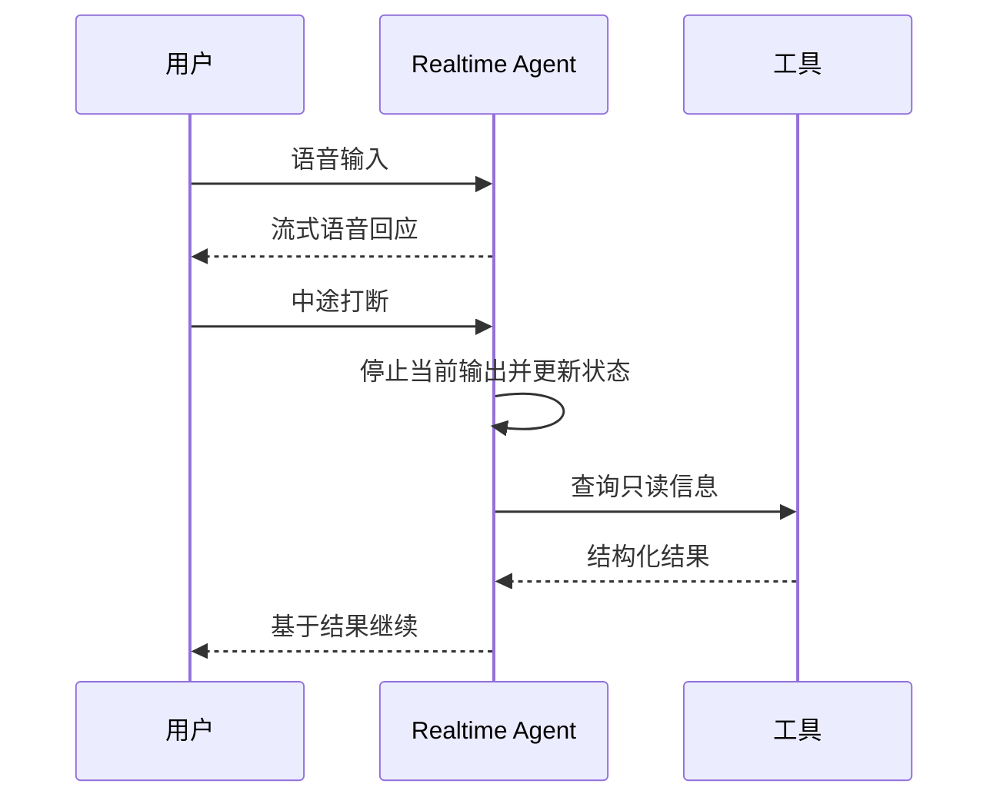
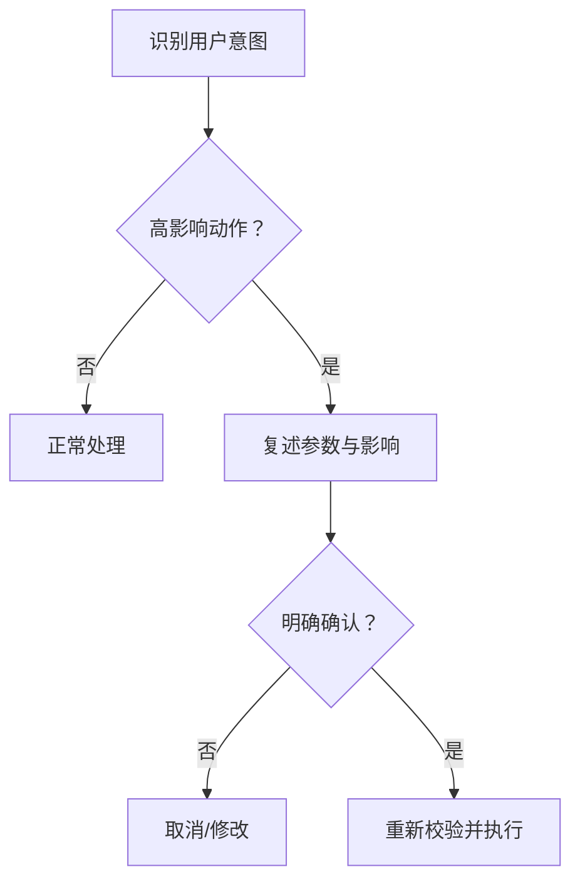

# 26｜Realtime Agent：低延迟语音与实时交互

## 1. 实时系统的新问题

语音 Agent 不只是把文本对话加上朗读。它要处理声音流、说话结束检测、用户打断、工具延迟、噪声、身份确认和会话状态。

## 2. 延迟预算

分别测量音频输入、语音活动检测、模型首包、工具调用和语音输出。平均延迟不足以说明体验，应关注首字/首音时间和 P95。

## 3. 打断与轮次

用户打断时立即停止或降低正在播放的声音，标记哪些内容尚未说完，并重新理解意图。不能在用户已经说“取消”后继续执行工具。

## 4. 高风险动作确认

语音容易误听。涉及金额、地址、接收人或发布动作时，应复述关键参数，并通过明确确认或第二渠道验证。

## 5. 周报助手示例

负责人可以语音询问“本周风险有哪些”，系统读出摘要；若说“发出去”，系统必须复述报告版本、接收范围和待确认项，并等待明确确认。

## 6. 常见错误

- 忽略用户打断；
- 把转写结果视为绝对正确；
- 工具调用时长时间无反馈；
- 语音确认没有复述关键参数；
- 背景声音触发操作；
- 保存原始音频却没有授权和保留策略。

## 7. 完成练习

设计语音查询周报风险的状态机，包含说话、打断、等待工具、取消和确认。模拟姓名或数字误识别，验证系统不会直接执行发布。

## 参考资料

- [OpenAI Realtime API](https://developers.openai.com/api/docs/guides/realtime)

[← 上一篇](./25-多模态人工智能.md) · [下一篇：微调与蒸馏 →](./27-微调蒸馏与模型适配.md)
