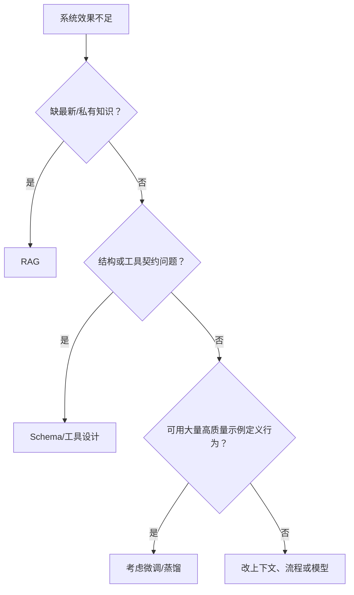
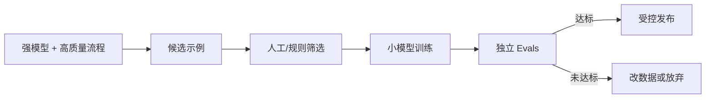

# 27｜Fine-tuning、蒸馏与模型适配

## 1. 什么时候不该微调

如果问题是资料过期，用 RAG；输出结构不稳定，用 Structured Outputs；工具调用错误，改工具设计和评估；业务流程不清，先修 Workflow。微调不适合“把新事实永久教给模型”。

## 2. 适合的目标

稳定风格、固定分类、领域格式、特定工具选择习惯或将强模型行为蒸馏到更小模型。前提是任务稳定、样本高质量且有独立评估集。

## 3. 数据准备

- 去除重复、错误和敏感样本；
- 保留真实输入分布和困难案例；
- 明确许可、来源和数据版本；
- 分开训练集、验证集与最终测试集；
- 不用模型未经人工确认的输出循环训练自己。

## 4. 蒸馏流程

## 5. 周报助手例子

先用强模型和人工流程积累数千条已批准的“原始记录→栏目分类”样本，再考虑训练小模型做分类。最终事实核查和发布审批仍不能被微调替代。

## 6. 评估和回滚

比较基线与适配模型的质量、延迟、成本、安全失败和长尾案例。保存模型、数据和评估版本；上线后监控分布变化并能够回滚。

## 7. 常见错误

- 用微调解决知识更新；
- 训练数据来自未经确认的模型输出；
- 数据包含秘密或无授权内容；
- 只比较平均准确率；
- 上线后没有漂移监控；
- 微调后删除原有护栏和审批。

## 8. 完成练习

为一个“周报条目分类”任务写微调决策表：为什么提示词和规则不足、需要多少已审核样本、采用哪些独立指标、何时停止项目或回滚。

## 参考资料

- [OpenAI Fine-tuning](https://developers.openai.com/api/docs/guides/fine-tuning)

[← 上一篇](./26-实时智能体.md) · [下一篇：AI 治理与红队 →](./28-人工智能治理与红队测试.md)
