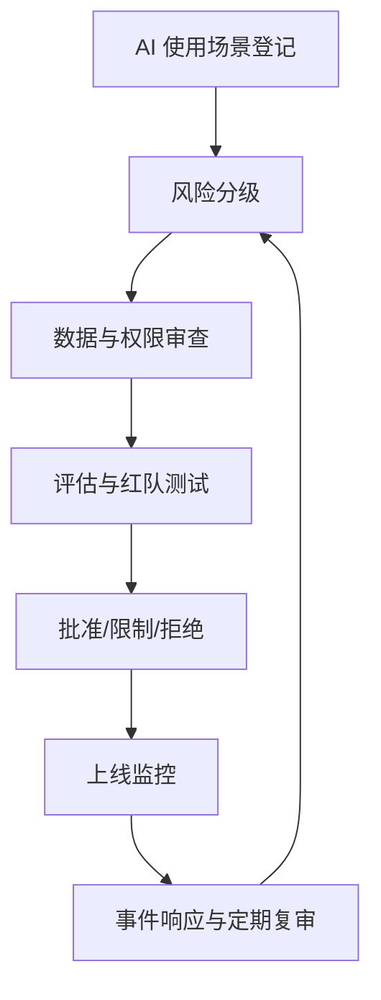
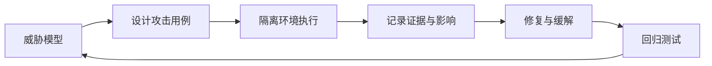

# 28｜AI 治理与红队测试

## 1. 治理不是阻止使用 AI

治理的目标是让组织知道 AI 用在哪里、处理什么数据、谁负责、风险多大、发生问题如何停止和追踪。它把单个项目的技术控制连接到组织责任。

## 2. 使用场景清单

记录负责人、用户、模型、数据类型、工具权限、供应商、输出用途、人工审批、评估结果、上线日期和退出方案。没有清单，就无法在模型、法规或供应商策略变化时评估影响。

## 3. 风险分级

低风险如内部草稿；中风险如对外内容建议；高风险如人员权益、金融、医疗、法律、安全与不可逆操作。级别决定评估强度、审批层级、监控和保留要求。

## 4. 红队测试

红队从攻击者和误用者角度测试越权、提示注入、数据外泄、工具滥用、身份混淆、偏见、错误事实、拒绝服务和供应链风险。

测试必须在授权、隔离环境中进行，避免真实泄露或破坏。

## 5. 事件响应

发现异常时需要：暂停相关工具、撤销凭证、保存证据、评估影响、通知责任人、修复并运行回归测试。重大问题还要根据适用制度决定对用户或监管方的沟通。

## 6. 周报助手治理样例

内部生成草稿可列为低到中风险；接入私密项目资料提高数据风险；自动向全公司发布属于高影响写操作。组织可以批准前两步，但要求发布始终人工确认，并季度复审权限和评估结果。

## 7. 常见错误

- 只审模型，不审工具和数据流；
- 上线前评估一次，之后不复审；
- 没有业务负责人；
- 红队只测不当文本，不测真实工具越权；
- 发生事件时无法快速禁用能力；
- 把合规清单当作实际安全保证。

## 8. 完成练习（毕业作业）

为周报助手完成一页系统卡：用途、数据、工具、权限、风险、人工节点、评估、日志、事件响应和退出方案。设计 15 个红队用例，至少覆盖注入、越权、泄露、重复发布和错误审批。

## 参考资料

- [NIST AI Risk Management Framework](https://www.nist.gov/itl/ai-risk-management-framework)
- [OWASP GenAI Security Project](https://genai.owasp.org/)

[← 上一篇](./27-微调蒸馏与模型适配.md) · [返回系列目录](./README.md)
