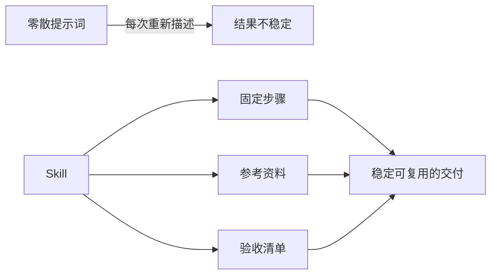

# Skill：把重复工作变成可复用流程

## 1. Skill 解决什么问题

提示词解决“一次任务怎么问”；Skill 解决“一类任务以后都怎么做”。当一个任务反复出现、存在固定资料和验收口径，或容易遗漏步骤时，就值得做成 Skill。

以“生成项目周报”为例，普通提示词可能只有“帮我写周报”；Skill 则明确：收集哪些材料、先核查什么、输出哪些栏目、什么内容不得猜测、谁最终确认。



## 2. 什么时候值得创建

满足其中两项即可考虑：

- 每周或每月重复发生；
- 经常需要同类资料、固定格式或固定语气；
- 出错代价高，且能写出检查项；
- 成果需要交给固定受众；
- 你已经手工完成过至少两次，知道正确步骤。

不要为一次性问题或尚未跑通的流程急着做 Skill。先人工跑通，再把稳定部分固化。

## 3. 一个好 Skill 的最小结构

在 Codex 中，Skill 通常是一个带 `SKILL.md` 的目录，也可以附带脚本和参考资料。其核心不在文件名，而在于指令足够具体、边界足够清楚。

```text
weekly-report/
├── SKILL.md              # 触发条件、步骤、边界、验收
├── references/
│   └── report-style.md   # 团队语气与栏目定义
└── scripts/
    └── validate.ts       # 可选：检查格式、空字段或日期
```

`SKILL.md` 至少要回答六个问题：何时使用、需要什么输入、分几步完成、输出长什么样、哪些事不能做、如何验收。

## 4. 示例：周报 Skill 的写法

下面是简化版，不依赖任何特定工具。

```markdown
---
name: weekly-report
description: 根据本周工作记录生成供负责人确认的中文周报。
---

## 输入
- 已脱敏的工作记录、会议纪要和任务状态；
- 本周时间范围；
- 已确认的目标或里程碑。

## 步骤
1. 先按“成果、进行中、风险、下周计划”分类；
2. 标出没有责任人、日期或依据的内容为“待确认”；
3. 不把计划写成已完成，不编造数据或客户反馈；
4. 生成 300～500 字周报和一张待确认清单；
5. 由负责人确认后才可发送。

## 验收
- 每个成果都能追溯到输入材料；
- 风险至少包含影响和下一步；
- 待确认项未被模型自行补全。
```

## 5. 使用时的对话示例

**用户输入：** “使用 weekly-report Skill。范围为 7 月 14 日至 18 日，下面是脱敏后的工作记录……”

**AI 应先做：** 复述任务范围，并列出材料缺口，例如“项目 A 的负责人未出现”“上线日期只有‘下周’这一模糊说法”。

**AI 不应做：** 把“预计下周上线”写成“已上线”，或根据上下文猜测负责人姓名。

## 6. 迭代 Skill 的方法

每次使用后只记录三类信息：遗漏了什么、哪条指令不够清楚、哪项验收能提前发现问题。下次只改一个点并对比结果，避免把 Skill 变成长而难用的说明书。

| 现象 | 可能原因 | 改进方式 |
| --- | --- | --- |
| 周报总是空泛 | 输入缺少量化事实 | 要求提供成果证据或标为待确认 |
| 责任人常错 | 模型在推测 | 加入“未明确时只写待确认” |
| 语气不统一 | 缺少受众与范例 | 增加一份已批准的参考周报 |

## 7. 完成练习

选一个每周重复的任务，写出一页 Skill：输入、五步以内流程、禁止事项、三条验收标准。连续使用两周；若第二周仍需重写大半内容，说明流程尚未稳定，应先改输入或验收，而不是不断加长提示词。

## 参考

[OpenAI Codex：构建 Skills](https://learn.chatgpt.com/docs/build-skills.md)
