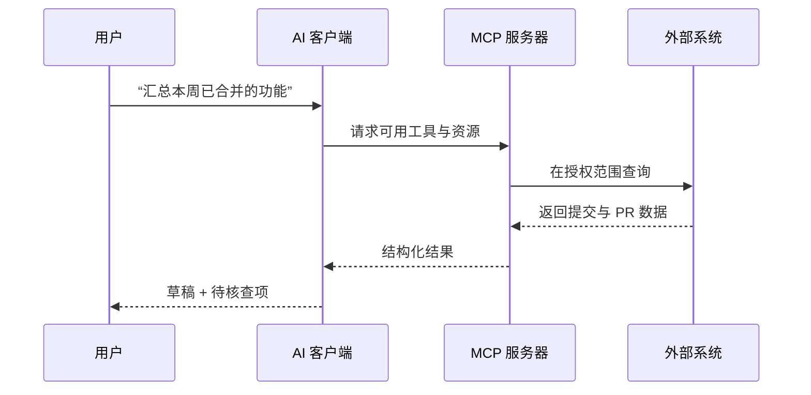
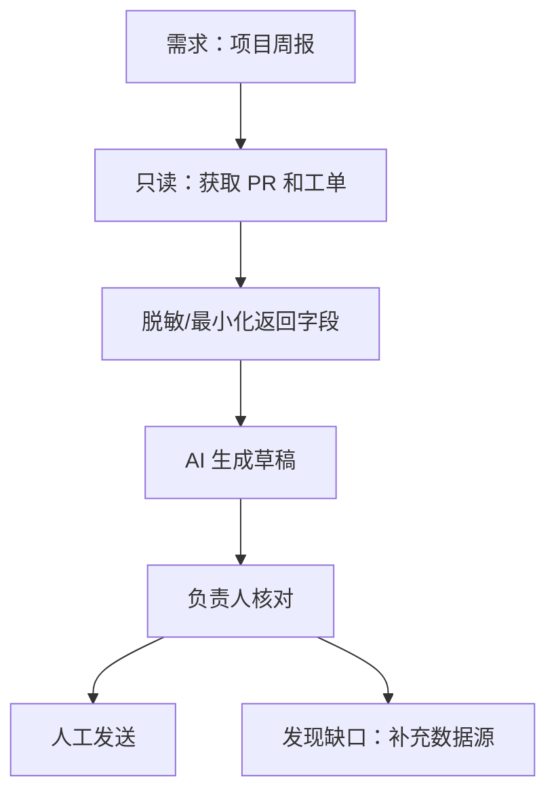

# MCP：给 AI 接入外部工具与可信上下文

## 1. MCP 是什么

MCP（Model Context Protocol）是一种让模型或 AI 客户端连接外部工具和上下文提供方的标准。它适合连接 GitHub、Figma、内部文档、工单系统、数据库查询服务或浏览器等能力。

它解决的不是“怎么写得更像人”，而是“模型如何在授权范围内拿到真实资料、调用正确工具”。



## 2. MCP、连接器与普通 API 的区别

| 方式 | 谁决定调用 | 常见用途 | 关键风险 |
| --- | --- | --- | --- |
| 普通 API | 你的程序代码 | 系统间固定集成 | 凭证、接口变更 |
| Function Calling | 模型提出、应用执行 | 有限的业务动作 | 参数校验、误调用 |
| MCP | 客户端通过协议发现并调用外部能力 | 多工具、多上下文的 AI 工作流 | 权限过大、工具说明被误导 |

MCP 可以承载工具和资源，但它并不自动让一次操作变得安全。认证、授权、审批与审计仍应由服务端和组织制度负责。

## 3. 从只读开始：项目周报场景

第一版 MCP 应尽量只读。周报场景只需要读取：本周合并的 PR、关闭的工单、项目文档中的里程碑。它不需要删除分支、修改工单或发送邮件。



**最小字段示例：** PR 标题、合并日期、状态、关联项目标签。不要默认返回提交者邮箱、访问令牌、完整评论历史或无关客户数据。

## 4. 工具设计：小而清楚

与其提供一个“万能查询”工具，不如提供含义明确、权限可控的工具。

```json
{
  "name": "list_merged_pull_requests",
  "description": "列出指定项目和时间范围内已合并的拉取请求；只返回标题、日期、URL 和标签。",
  "input": {
    "project": "string",
    "start_date": "YYYY-MM-DD",
    "end_date": "YYYY-MM-DD"
  }
}
```

好的描述能帮助 AI 选择工具；窄输入和窄输出能帮助系统控制风险。工具描述中还应声明时区、分页限制、是否只读以及失败时返回什么。

## 5. 权限与防护清单

- 默认只读；写操作与删除操作拆成独立工具；
- 每个工具使用独立、最小权限的服务身份；
- 不把令牌、密码、完整内部文档原样返回给模型；
- 对模型传入的项目名、日期、ID 做服务端校验；
- 为调用记录用户、时间、参数摘要、结果状态与错误；
- 遇到“发送、发布、创建、修改、删除”时要求用户或责任人确认；
- 把外部系统返回的文本视为不可信输入，不能让其中的指令覆盖你的安全规则。

## 6. 失败时怎么办

| 情况 | 正确处理 |
| --- | --- |
| 无权限 | 明确告知缺少什么权限，不尝试绕过 |
| 没有数据 | 返回空结果与查询范围，不编造“没有进展” |
| 返回字段不完整 | 标注待确认项，允许人工补充 |
| 工具超时 | 告知失败，提供重试或缩小范围选项 |
| 写操作未确认 | 停止在预览阶段，不执行 |

## 7. 完成练习

为一个真实场景画出“用户—AI—MCP—外部系统”的数据流，并为每一条箭头写明：传递什么数据、需要什么权限、是否可写、谁负责确认。若这四项答不清，就还不应连接真实系统。

## 参考

[OpenAI Codex：MCP](https://learn.chatgpt.com/docs/extend/mcp)
