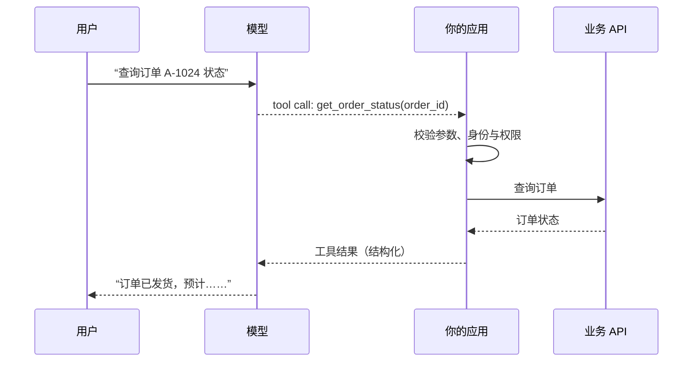
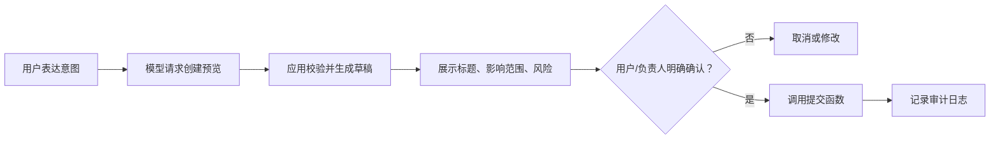

# Function Calling：让模型提出受控的结构化操作

## 1. 它到底在做什么

Function Calling（也常称 Tool Calling）不是把服务器权限交给模型。正确的流程是：应用把允许调用的函数及其参数结构告诉模型；模型返回“我想调用哪个函数、参数是什么”；应用验证、授权并执行；应用把执行结果回传给模型；模型再生成面向用户的说明。



模型负责理解自然语言和选择工具；应用负责确定性操作、权限控制、异常处理和真实世界的副作用。

## 2. 适合与不适合的任务

适合：查询订单、检索库存、创建草稿工单、计算报价、获取日历空闲时间、触发经过确认的报表生成。

不适合：要求模型自行决定退款、解雇、转账、删除数据、修改生产环境或绕开审批。高影响操作必须由业务规则和人工确认控制，而不是由自然语言暗示决定。

## 3. 从函数定义开始

函数应小、单一、可验证。以下以“创建工单草稿”为例；它只创建草稿，不直接发送或执行。

```json
{
  "type": "function",
  "name": "create_ticket_draft",
  "description": "根据已经确认的客户问题创建工单草稿。不会提交、发送或分配工单。",
  "parameters": {
    "type": "object",
    "properties": {
      "title": { "type": "string", "description": "不超过 80 个字符" },
      "summary": { "type": "string", "description": "只包含用户已提供的事实" },
      "priority": { "type": "string", "enum": ["low", "normal", "high"] }
    },
    "required": ["title", "summary", "priority"],
    "additionalProperties": false
  }
}
```

关键点：使用枚举限制优先级；把“创建草稿”和“提交工单”分开；明确不允许模型补充没有证据的事实。

## 4. 应用端必须做的事

即使模型参数完全符合 JSON Schema，应用仍必须再次检查。下面的 TypeScript 伪代码突出控制点：

```ts
async function handleToolCall(call: ToolCall, user: User) {
  if (call.name !== "create_ticket_draft") throw new Error("不支持的工具");

  const args = validateAgainstSchema(call.arguments); // 类型、枚举、长度
  requirePermission(user, "ticket:draft:create");    // 身份与授权
  rejectSensitiveData(args.summary);                  // 数据边界

  const draft = await ticketService.createDraft({
    ...args,
    createdBy: user.id,
  });

  await auditLog.write({ userId: user.id, tool: call.name, result: "success" });
  return { draft_id: draft.id, status: "preview", requires_confirmation: true };
}
```

不要把工具参数直接拼接为 SQL、Shell 命令、URL 或生产配置；应使用参数化查询、白名单和服务端业务接口。

## 5. 两阶段确认：先预览，后执行

涉及副作用的任务应分两次完成。



例如“帮我给所有客户发延期通知”不能直接发送。第一步只能生成收件人范围、草稿和预计影响；确认后才调用独立的 `send_delay_notice`，并在服务端再次检查收件人数量与权限。

## 6. 常见失败与修复

| 失败 | 根因 | 修复 |
| --- | --- | --- |
| 模型选错函数 | 函数描述含糊、职责重叠 | 缩小工具边界，补充何时使用/不使用 |
| 参数看似合法但业务无效 | 只做了 schema 校验 | 增加业务规则校验，例如订单归属、状态机 |
| 意外写入或发送 | 把预览和执行混为一个函数 | 两阶段确认，写操作独立授权 |
| 工具返回太多敏感数据 | 输出字段无限制 | 只返回完成当前任务所需的字段 |
| 用户无法追溯操作 | 没有日志或请求 ID | 记录调用链、版本、审批与结果 |

## 7. 完成练习

选择“查询库存”或“创建工单草稿”之一，写出：函数名称、参数 schema、应用端校验、返回字段、失败信息和确认规则。若其中包含写操作，必须拆出“预览函数”和“执行函数”。

## 参考

[OpenAI：Function calling 指南](https://developers.openai.com/api/docs/guides/function-calling)
