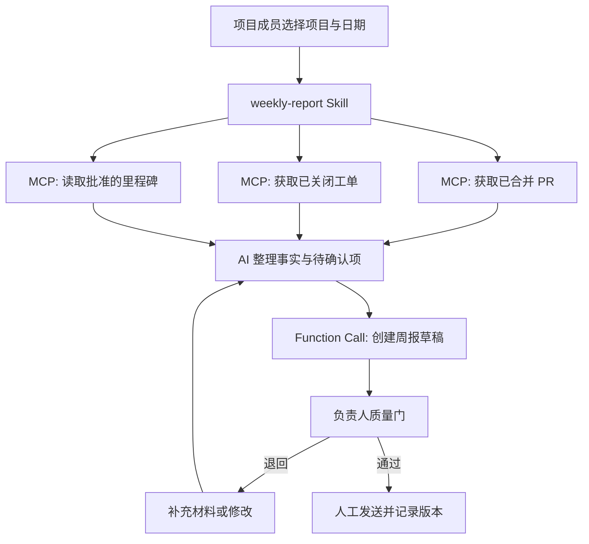
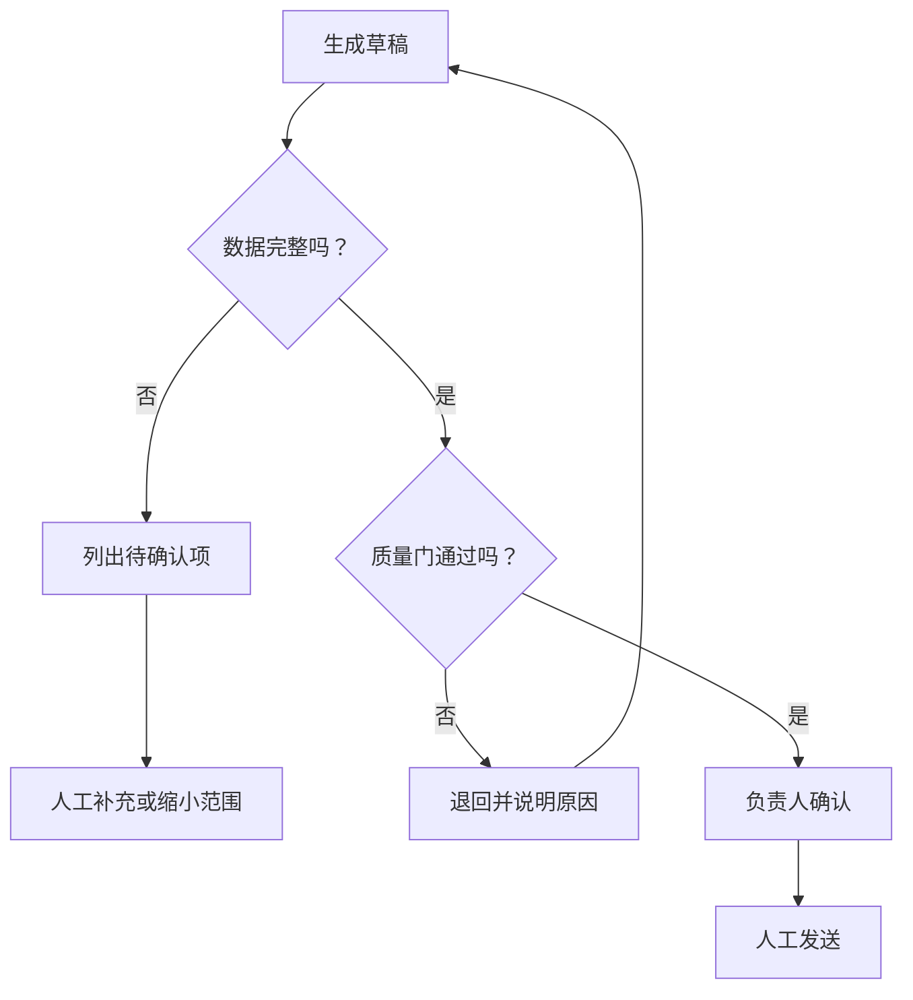

# 端到端案例：从项目资料到可确认的周报

本案例把 Skill、MCP 与 Function Calling 放在同一条流程里。目标不是“让 AI 自动发周报”，而是更快生成一份**可追溯、可核查、由负责人确认**的周报。

## 1. 目标、边界与角色

**目标：** 每周五生成项目周报草稿，供项目负责人确认。

**边界：** 只读取本周已合并 PR、已关闭工单、已批准的里程碑记录；不读取令牌、私密评论、客户联系方式；不自动发送邮件。

| 角色 | 责任 |
| --- | --- |
| 项目成员 | 提供或确认项目范围与特殊情况 |
| Skill | 规定整理、核查、输出和复盘步骤 |
| MCP 工具 | 只读获取 PR、工单与里程碑摘要 |
| Function Calling | 创建“周报草稿”并保存版本，不发布 |
| 项目负责人 | 核对事实、风险与语气，决定是否发送 |



## 2. 第一步：Skill 固定工作方法

Skill 中不应该写死某个项目的数据，而应写清共同规则：

```text
1. 仅使用 MCP 返回的本周事实和用户补充内容；
2. 将内容分为成果、进行中、风险、下周计划、待确认；
3. 没有原始依据的内容不得写入“成果”；
4. 每条风险写明影响、负责人和下一步；
5. 先调用 create_weekly_report_draft 创建预览；
6. 未获得项目负责人确认，不得调用任何发送或发布工具；
7. 记录本次耗时、待确认数和被退回条目。
```

## 3. 第二步：MCP 只读获取上下文

建议为 MCP 工具提供三个窄接口：

| 工具 | 输入 | 输出 | 权限 |
| --- | --- | --- | --- |
| `list_merged_prs` | 项目、日期范围 | 标题、日期、链接、标签 | 只读 |
| `list_closed_tickets` | 项目、日期范围 | 标题、状态、关联标签 | 只读 |
| `get_milestone_summary` | 项目、里程碑 ID | 已批准的目标与状态 | 只读 |

当其中一个工具无数据时，模型应写“未获取到数据，待确认”，而不是推断项目没有进展。

## 4. 第三步：Function Calling 只创建草稿

草稿函数示例：

```json
{
  "name": "create_weekly_report_draft",
  "description": "保存待负责人审核的周报草稿；不发送、不发布。",
  "parameters": {
    "type": "object",
    "properties": {
      "project_id": { "type": "string" },
      "week_start": { "type": "string" },
      "week_end": { "type": "string" },
      "content": { "type": "string" },
      "open_questions": { "type": "array", "items": { "type": "string" } }
    },
    "required": ["project_id", "week_start", "week_end", "content", "open_questions"],
    "additionalProperties": false
  }
}
```

应用端还应确认项目成员对 `project_id` 有权限、日期范围不超过允许窗口、内容不含敏感字段，并返回可审计的草稿 ID。

## 5. 第四步：负责人质量门

负责人用下面的清单审核，而不是只看文笔：

- 每项成果是否能链接到 PR、工单或已批准材料？
- 是否把计划、假设或待确认信息误写成既成事实？
- 风险是否包含影响、责任人和下一步？
- 是否包含不应对外发送的数据？
- 语气、长度和结构是否适合接收者？
- 草稿版本、审核人和审核时间是否已记录？

## 6. 异常处理图



## 7. 如何衡量是否值得保留

连续四周记录以下指标，并与手工流程的基线比较：

| 指标 | 目标 | 发现问题时优先检查 |
| --- | --- | --- |
| 生成到确认耗时 | 缩短，但不跳过审核 | Skill 步骤是否冗余 |
| 待确认项数量 | 逐步下降 | MCP 数据是否不足 |
| 审核退回次数 | 逐步下降 | 事实规则是否不清楚 |
| 风险或隐私事件 | 必须为 0 | 权限和输出字段是否过宽 |
| 模板复用次数 | 稳定提升 | 是否真的适合高频任务 |

## 8. 你可以复制的实施顺序

1. 先只用 Skill + 人工粘贴资料，跑通两周；
2. 再接入一个只读 MCP 工具，验证字段是否足够；
3. 最后接入“创建草稿”的 Function Calling；
4. 稳定后才考虑“发送”之类的写操作，并保留单独确认；
5. 每月复盘指标，淘汰不能降低返工或风险的自动化。

这种渐进方式的价值在于：任何一步出问题都能定位是流程、数据、工具还是审批出了问题，而不是把所有能力一次性接入后无法排查。

## 继续完善

回到[专题首页](./README.md)复查能力选择；需要细化流程、外部连接或工具调用时，分别参阅 [Skill](./01-技能与可复用流程.md)、[MCP](./02-MCP与外部工具连接.md) 与 [Function Calling](./03-函数调用与结构化操作.md)。
