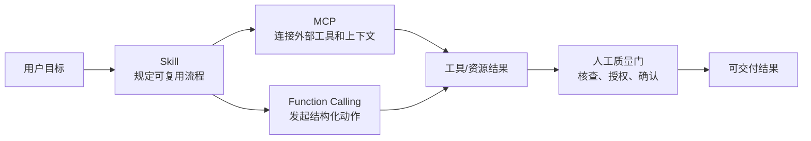
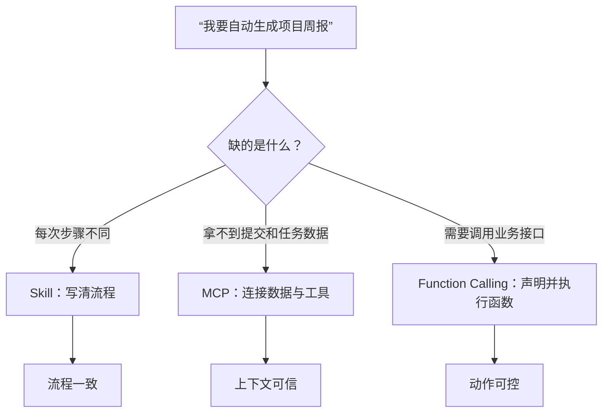

# AI 能力系统：Skill、MCP 与 Function Calling

> 更新：2026-07-20。本专题讲通用方法与 Codex/OpenAI 生态中的常见实现，不替代组织的安全制度、API 文档或专业意见。

当对话只能生成文字时，AI 更像一位顾问；当它拥有可复用流程、可信上下文和受控工具后，才开始成为能够完成任务的系统。

## 先选择正确的能力层

| 你遇到的问题 | 优先使用 | 原因 |
| --- | --- | --- |
| 每周都按同一规则生成周报 | [Skill](./01-技能与可复用流程.md) | 把步骤、口径和验收标准固定下来 |
| 需要读取 GitHub、Figma、内部知识库或浏览器中的信息 | [MCP](./02-MCP与外部工具连接.md) | 让 AI 在授权范围内访问外部工具与资料 |
| 需要查询订单、创建工单、调用内部服务 | [Function Calling](./03-函数调用与结构化操作.md) | 用受校验的结构化参数触发确定性操作 |
| 需要把三者串成可靠交付 | [端到端案例](./04-端到端项目周报案例.md) | 明确数据、权限、人工确认和复盘 |

## 学习路径

1. 先读 Skill，学会把重复任务从“记在脑中”变成可复用流程；
2. 再读 MCP，理解 AI 能访问什么、不能访问什么；
3. 接着读 Function Calling，理解模型如何提出工具请求、应用如何执行；
4. 最后完成端到端案例，把周报流程跑成一个可审查的闭环。

## 三个容易混淆的概念

- **Skill 不是工具。** 它是“遇到这类任务，应该怎样做”的可复用说明，可附带脚本和资料。
- **MCP 不是提示词。** 它是模型与外部工具、资源之间的连接协议。
- **Function Calling 不是让模型直接执行任意代码。** 模型只会提出符合函数定义的调用请求；真正执行、鉴权、校验和记录均由你的应用负责。

## 共同安全原则

1. 只提供完成任务所需的最少数据和最少权限；
2. 读取不等于允许写入；创建、发送、删除、支付等动作要有明确确认；
3. 模型输出和工具返回都可能出错，关键结论要回到原始来源；
4. 为重要流程保留输入来源、调用参数、结果版本、审批人与异常记录；
5. 先在测试数据或只读环境中验证，再接入真实业务。

## 参考资料

- [OpenAI Codex：构建 Skills](https://learn.chatgpt.com/docs/build-skills.md)
- [OpenAI Codex：Model Context Protocol](https://learn.chatgpt.com/docs/extend/mcp)
- [OpenAI：Function calling 指南](https://developers.openai.com/api/docs/guides/function-calling)
- [NIST AI Risk Management Framework](https://www.nist.gov/itl/ai-risk-management-framework)
